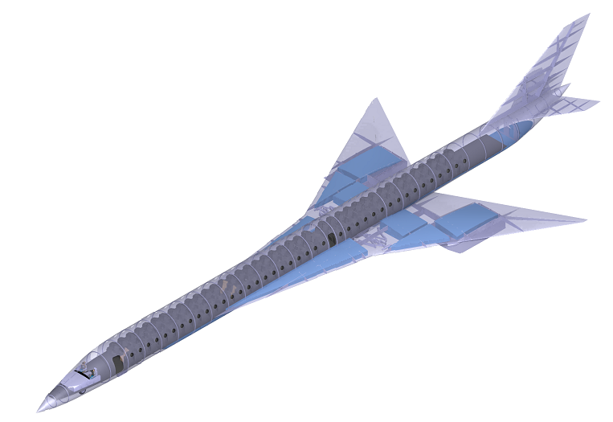

Our senior capstone project entailed designing a supersonic transport capable of traveling 7,500NM at Mach 2.2 with 80 passengers. The aircraft had to meet the initial requirements, as well as the FAA, and ICAO requirements for passenger aircraft.

Our team consisted of 11 engineers split along 6 subsystems; aerodynamics, structures, weight and balance, propulsion, stability and control, and CAD.
The projected was separated into two phases; Phase 1 (Fall semester) was the preliminary design and analysis. Phase 2 (Spring semester) consisted of fabrication and wind tunnel testing of the model.

The project involved a preliminary design review (PDR) and a critical design review (CDR) to an independent panel of industry experts to judge the viability of the design.

My role within the project during Phase 1 was aerodynamics. I was tasked with developing the constraint analysis, estimate the CL vs. Alpha and CD vs. Alpha for the wing, strake, empennage, and aircraft, and calculate the takeoff and landing distances. During Phase 2, I was part of the test plan team I helped write the test procedures and along with everyone else, the report.

Another significant aspect of our project required us to make a compelling business argument for our design. We had to sell our design to our professors as well as an independent panel of judges from industry as to why our design warranted funding. We created a company name, logo and aircraft name. Apart from being judged on the technical aspects of our design, we were also judged on the professionalism of our presentaton.

One of the reasons I chose Riddle to study engineering was the hands-on nature of their curriculum. This was evident during our capstone project when we designed and built a wind-tunnel model to test our predicted values. Our model was 3D printed on a Stratasys Dimension 1200es 3D printer using ABS. 

  

The wings were reinforced with fiberglass resin and were tested structurally by determining the amount of lead shot the wings could support. This limit helped determine the max wind-tunnel speed. If vibrations or flutter were observed before the sturctural limit was reached, then that velocity set the max tunnel speed. 

  
  

After sanding, the model was painted and covered in tufts to help visualize airflow separation across the aircraft.

  

  
  
  
  

