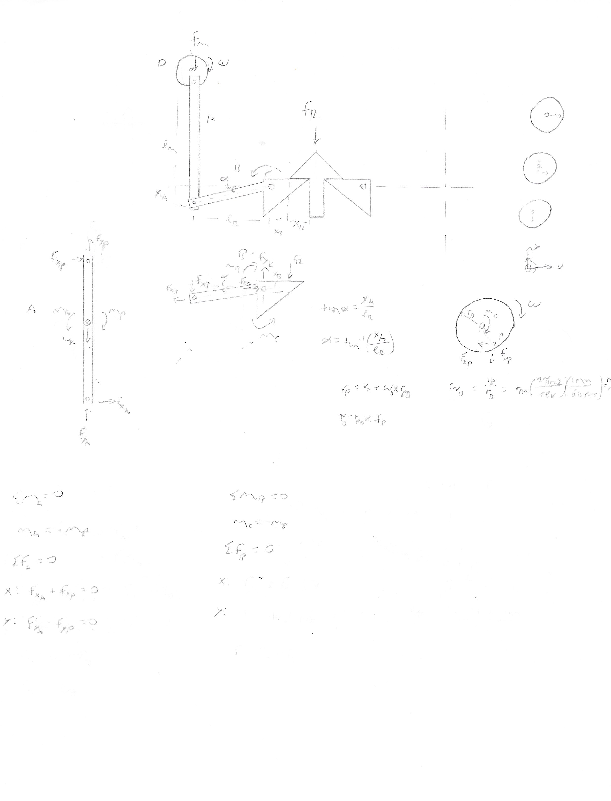
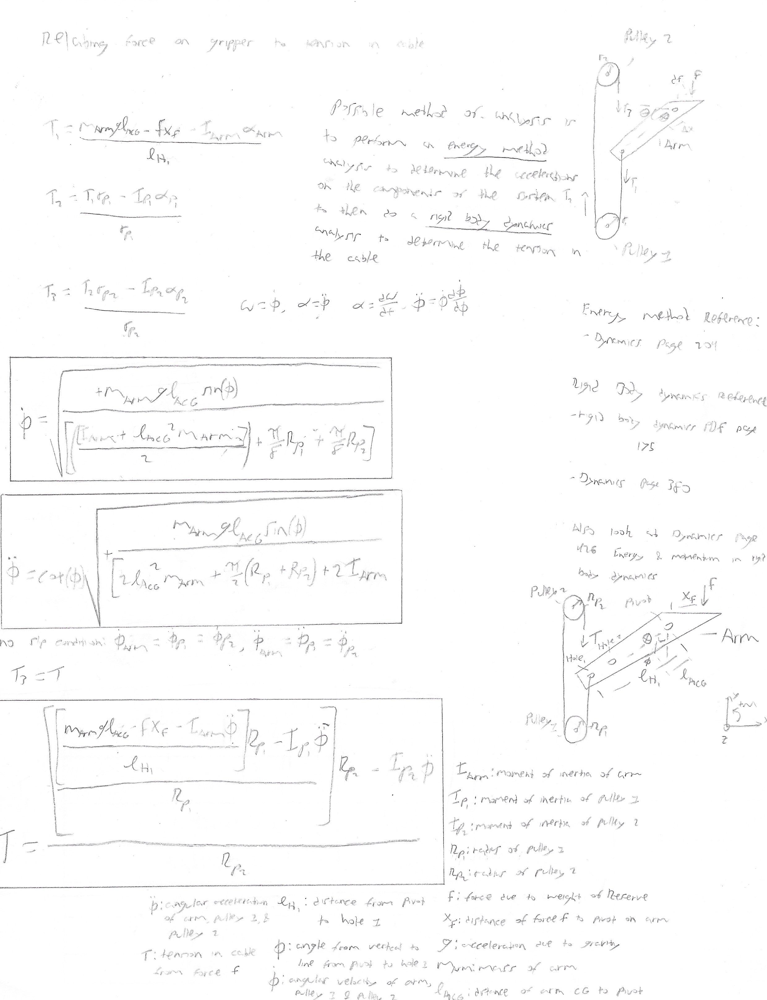

<h2>Concept</h2>

Below are the original sketches of the general concept. As the saying goes "a picture is worth a thousand words", I find it easier to describe the overall concept by showing various sketches and renders. All modeling and rendering was done in Solidworks. My typical workflow is to draw a rough sketch of the idea, ensure it makes sense on paper and then start modeling it in CAD.

The overall concept is one of two aircraft; a primary designated "Mother" and a secondary designated "Reserve". Mother is designed for maximum endurance carrying a surveillance package, while Reserve is designed for maximum payload capacity to haul two sets of batteries around. Reserve was orignally conceived to be a fixed-wing, tilt-rotor configuration with VTOL (Vertical Takeoff and Landing) capability. The original idea was to maximize payload capacity as well as range. However, after realizing the complexity of the control system needed to perform the docking manuever, Reserve was changed to a quadcopter configuration. This allows for VTOL capability, as well as much simpler flight controls for the docking sequence.

<h4>Version 1.0 Sketches</h4>
The first version of the docking system was of a mechanical apparatus consisting of two plates mounted on a member protuding from the top of Reserve, meshing into a groove set into the underside of Mother with two opposing plates catching the Reserve plates to lock the aircraft into place. Also visible in the sketches are early ideas for the battery attachment.

The first concept of the docking arm. The idea is to use the weight of Reserve to hold the aircraft together. This is accomplished through the use of pulleys at opposite ends of the system. Overall sizing is dictated by the volume required for the batteries.

An earlier version using gears to actuate the plates. The gears were quickly replaced with cables due to the efficiency of holding the plates in tension, rather then relying on the torque in the gears.

A front view of the docking system. Note the two cables on the lever providing opposing force to either grab or release the center member. The weight of Reserve produces a downward moment on the levers. This is opposed by the second cable mounted at the end of the lever and routed around the pulleys at the ends. 

The cables are mounted to a cross member that can translate along the longitudinal axis of the system. As the cross member slides towards the levers, the dock is engaged. Likewise, then the cross member slides away from the levers the dock is released.

<h3>Dynamics</h3>

After the initial design was finalized, I reviewed my dynamics notes and did an analysis on the arm and cable system to ensure it produced enough force to hold the two aircraft together.

<a href="Docking-Battery Mechanism M-1.pdf">Docking-Battery Mechanism Moment of Inertias</a>

<a href="Docking-Battery Mechanism M-1 Analysis.pdf">Docking-Battery Mechanism Analysis</a>

With distributing the force among four cables and levers, along with having a longer moment arm connected to the cable, the required force on the cross member to actuate the system is pretty reasonable. To connect the aircraft together, a max torque of 13oz-in is required in the arms and approximately 2.4 lbs-force in the cables. Assuming a factor of safety of 1.5 and rounding up equates to a max tension of 4 lbs-force or about 18 newtons. The Actuonix L12-R Micro Linear Servo was chosen with a gearing of 100:1 which provides 42 newtons of force to ensure plenty of force to withstand wind gusts.

<a href="https://www.actuonix.com/assets/images/datasheets/ActuonixL12Datasheet.pdf">Linear Actuator</a>

<h3>Version 1.0 Renders</h3>

<h5>Position 1</h5>

Levers in released position. Center groove is empty. Aircraft are undocked. Noticed how the first cable was replaced by a spring to keep tension in the cables when the levers are released.

<h5>Position 2</h5>

Levers in released position, center member is inside groove. Aircraft are midway through docking sequence.

<h5>Position 3</h5>

Levers in engaged positon, center member is presed against groove. Aircraft are docked.

<h5>Final Renders</h5>

<h5>Version 2.0</h5>

