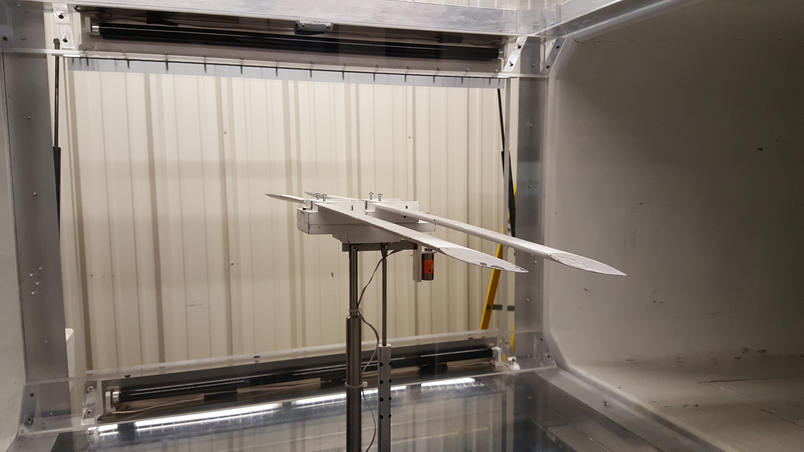
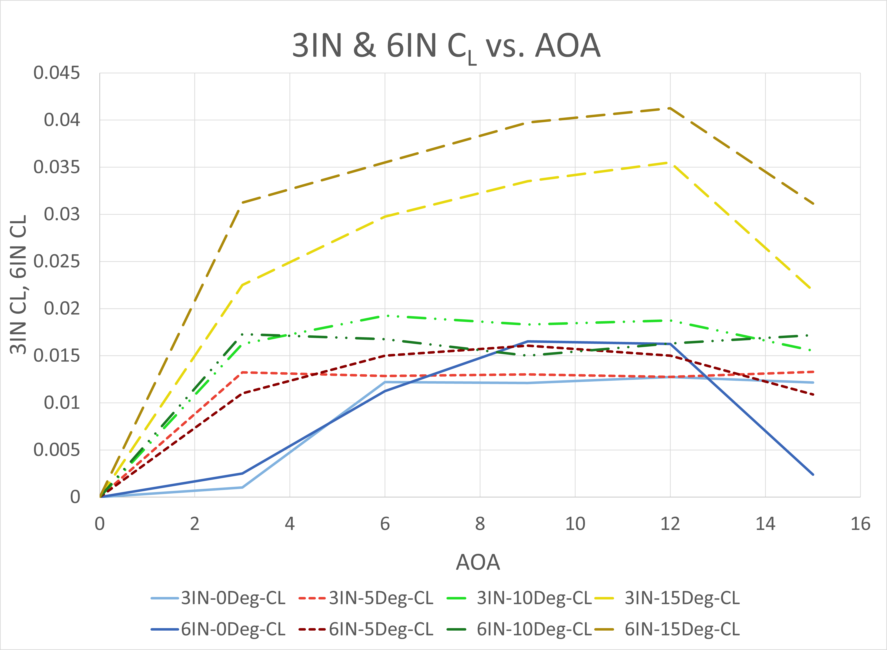
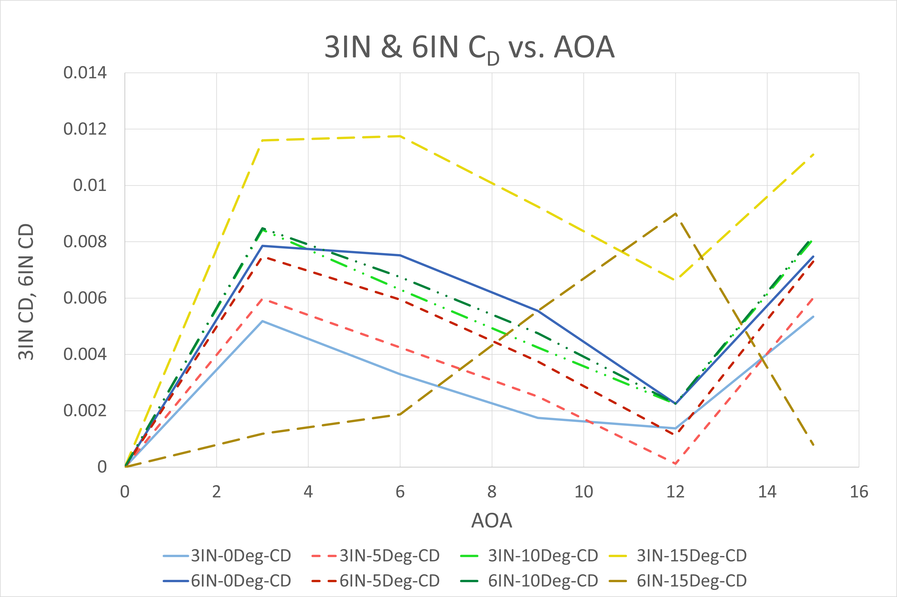
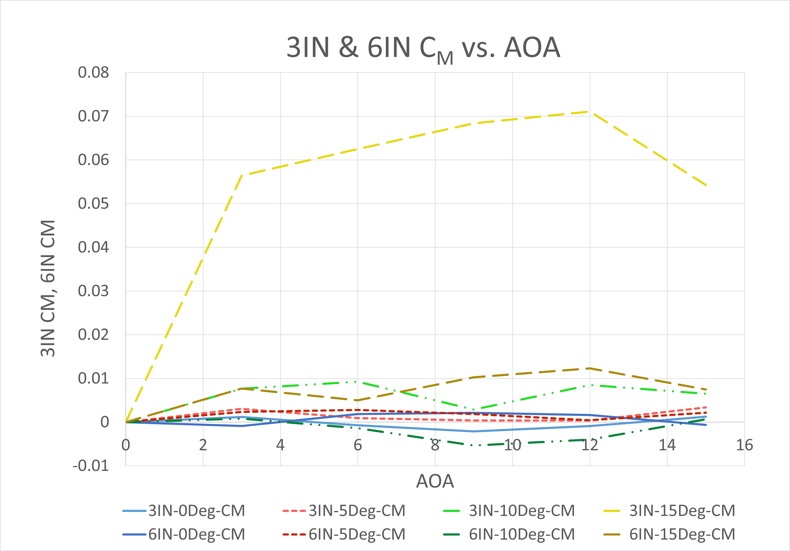
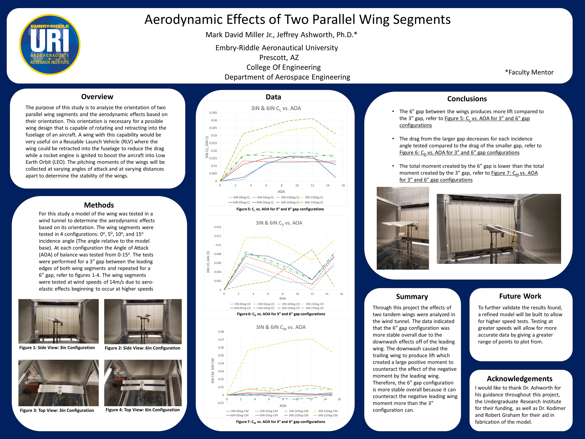

During the summer of 2016, I completed an independent study with my professor analyzing the effects of two wings in tandem. I designed, built, tested, analyzed, and finally presented my findings to the 97th AAAS conference held at the University of San Diego on June 14th-17th, 2017.

The original concept that I proposed was of a Reusable Launch Vehicle (RLV) where the wings would retract into the fuselage of the aircraft on flight to Low Earth Orbit (LEO). On reentry the wings would extend and allow the craft to land like an airplane, ready for the next flight. Below are the initial sketches that the concept was based on. Looking back now, the project gives me a good chuckle due to the overly complex mechanical systems needed for such a configuration, let alone the immense heat and drag upon reentry. However, I had a blast and learned a lot about wind-tunnel testing, data collection, model design and fabrication, and report writing.

<h3>Concept Sketches</h3>

  
  
  
  
  
  

<h3>Wind-Tunnel Testing</h3>
For simplicity the wind-tunnel model consisted of only two segments of this proposed wing design. The model was 3D printed using a Stratasys Dimension 1200es 3-D printer using ABS plastic. The wings were reinforced with two steel rods connecting the wing segments. The base featured a pivot to adjust the wing incidence from 0-15 degrees. The longitudinal separation between the wings could be adjusted from 3-6 inches. During testing, the angle of attack (AOA) was varied from 0-15 degrees.

<h3>Data</h3>
The wind-tunnel results confirmed the initial analysis that the larger gap would be more stable due to the downwash off the leading wing onto the trailing wing. This downwash caused the trailing wing to produce lift at higher AOA's than the leading wing. When the leading wing began to stall at 15deg AOA, the 6in configuration allowed the trailing wing to see a lower AOA, resulting in a positive, nose down pitching moment to counteract the negative, nose up pitching moment caused by the leading wing stalling.

The 3in configuration at 15deg AOA, didn't produce as much downwash onto the trailing wing, therefore when the leading wing stalled at 15deg AOA, the trailing wing couldn't counteract it, resulting in the very large pitching moment coefficient relative to the 6in configuration at 15deg AOA.

<h3>Poster</h3>
The final poster presented at the AAAS scientific conference in San Diego. Sadly I didn't win any awards. :(

