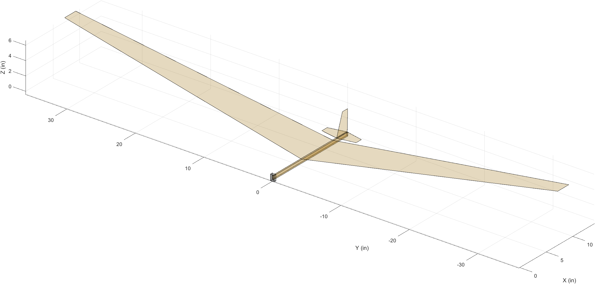
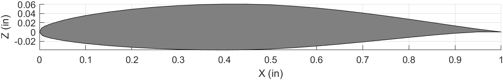
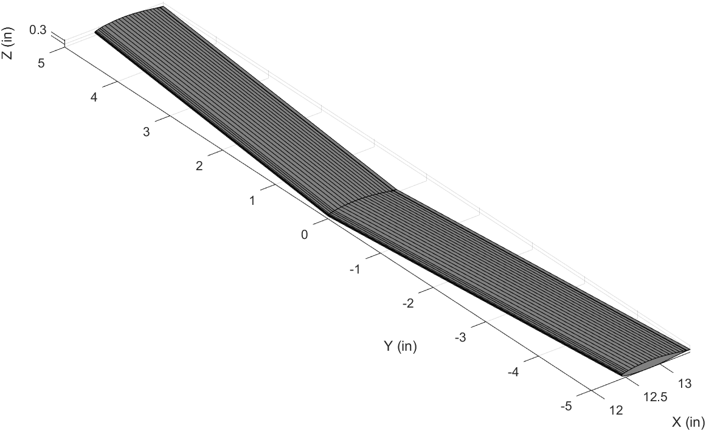
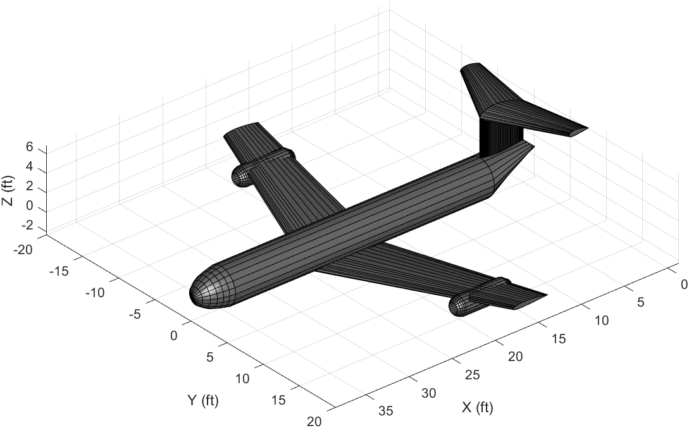

<h4>Background</h4>

Before I start to dive into the inner workings of this program, I'd like to provide a little backstory which I think will help understand why I started this project as well as how far it has come. During my senior year at Embry-Riddle, I took a course called <i>Stability and Controls</i> which was part of my degree, Aerospace Engineering. One of our last projects was to design a balsa wood glider according to our lectures and test fly it in the gymnasium. To achieve a satisfactory grade, our glider had to travel a certain distance, if I remember correctly at least a 100 feet. To aid in designing our gliders, our professor provided us with a MATLAB script that plotted a 3D model of our glider so we could get an idea of what our design looked like before we constructed it.

The image below is of the balsa wood glider model.

While this figure might not seem like much, it was the first time I had seen 3D graphing capabilities in MATLAB. MATLAB was the standard coding language taught to AE students and I had already taken the requisite introductory course during my sophmore year. However, we were only taught basic graphing and plotting of data points, nothing close to 3D modeling. One of the first things I picked out on the model was the wing. I noticed how the wing was modeled as a 2D plane with the "airfoil" being a rectangle. Technically it's just a plane, but the idea is the same. I began to wonder if it was possible to model the wing with an airfoil instead. First I had to figure out how to plot an airfoil from it's coordinates. Turns out it's pretty simple.

Next was modeling a wing. Adding taper, dihedral, and sweep is fairly straightforward, just a few extra variables. At this point I was pretty excited, I wanted to see just how far I could develop this concept of modeling an aircraft.

It turns out it wasn't that difficult at all. The horizontal and vertical tails, were modeled as wings with smaller dimensions. The fuselage was modeled as a cylinder with the nosecone and tailcone, both being modeled as cylinders with closed ends. Finally, the engines were modeled as mini fuselages with open ends. 

At this point you might be forgiven for thinking this was the end of the project, however it was actually just the beginning. I realized that as cool as it was to "model" or "design" an aircraft in MATLAB, I actually wasn't really doing anything, nothing was being calculated or analyzed. Also, it wasn't even really designing because I lacked any sort of requirements definition. To really design an aircraft I had to start at the very beginning and work through each step in aircraft design to truly "design" an aircraft. 