<h3>Code</h3>

All of the code for PAC is hosted on GitHub at the link on the page's home site. However, I would like to deep into two features of PAC that took a decent amount of effort and describe how they work in depth. One of the most significant features of PAC is the ability to model a wing with different airfoils for the root and tip, and the ability to create a multi segment wing relatively easily. 

The first, the ability to model a wing with a different root and tip airfoil was much more difficult than originally anticipated. The difficulty has to do with how MATLAB graphs an object. As alluded on the <b>Background</b> page, graphing a single airfoil is trivial, along with extending that approach out to a wing. Each airfoil has a set of coordinates that describe its shape along the X-Y axis. The wing is plotted by drawing a line from the trailing edge of the first airfoil to the trailing edge of the second airfoil. A line is then drawn along the airfoil cross-section to the next X-coordinate. Another line is then drawn from the second airfoil to the first airfoil. Finally, a line is drawn along the airfoil cross-section again to complete the face. As shown under <b>Wing Plotting Steps</b> this process is repeated across the entire airfoil cross-section.

<iframe type="text/html" src="naca2412.html" width="150" height="700"></iframe>

<br>

<h5>Wing Plotting Steps</h5>
<div class="text-center p-4">
    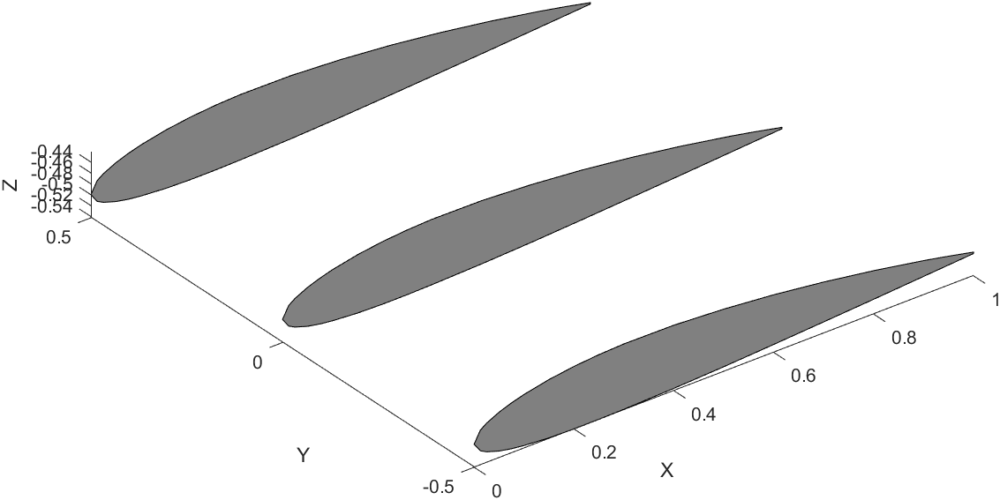
    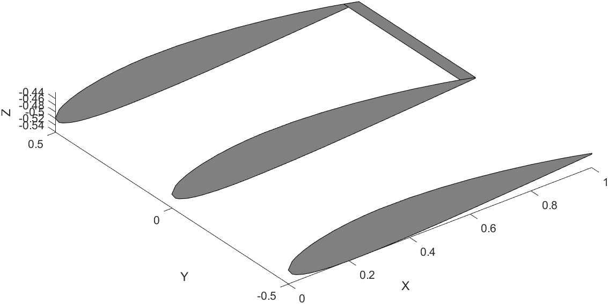
    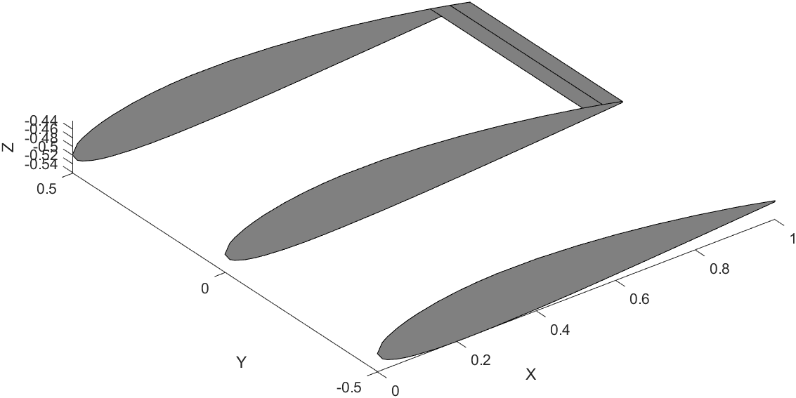
    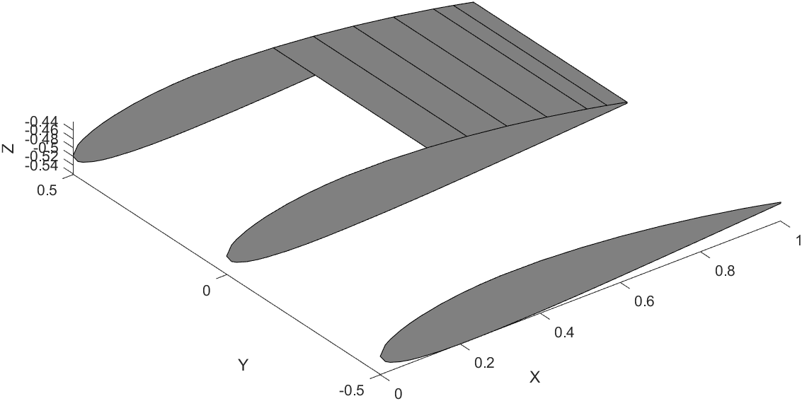
    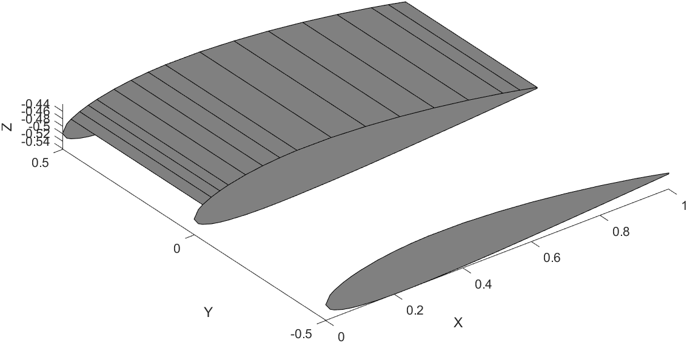
    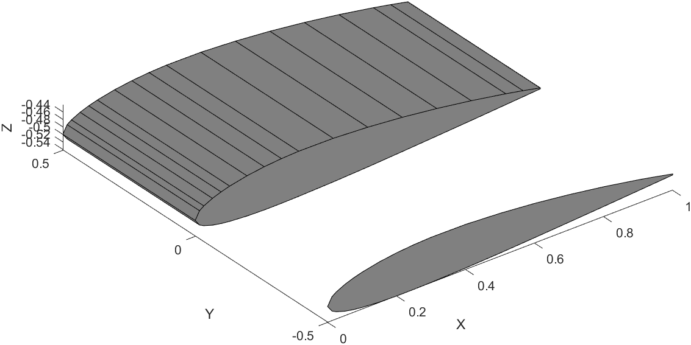
    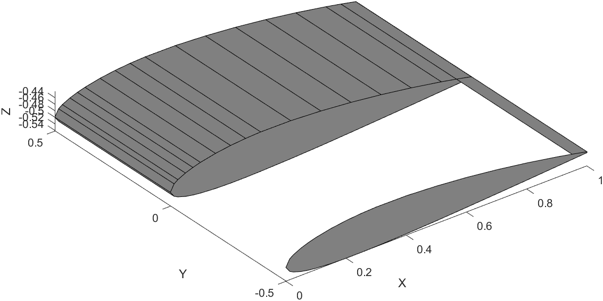
    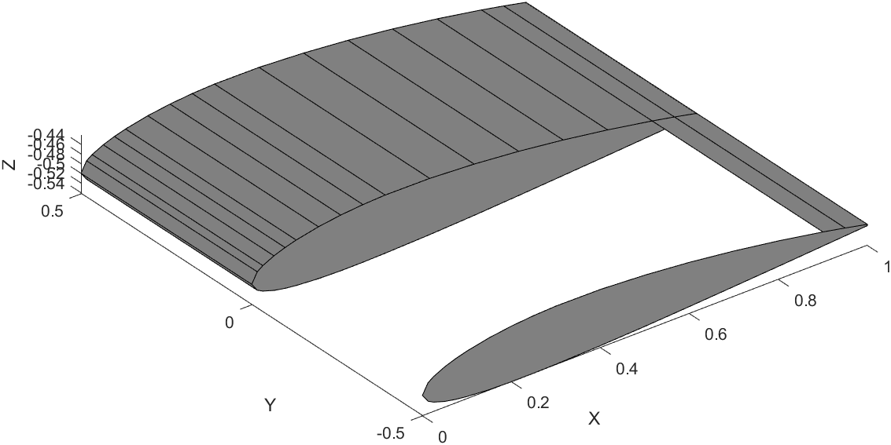
    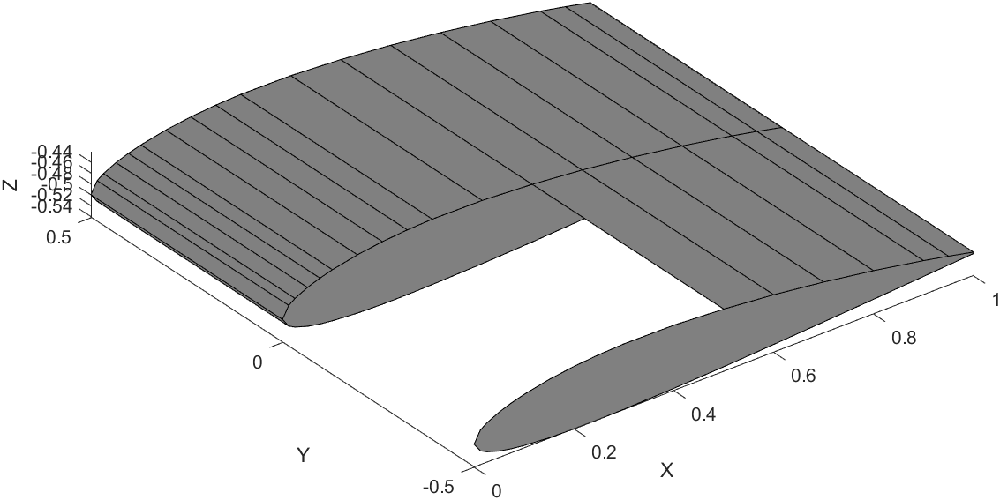
    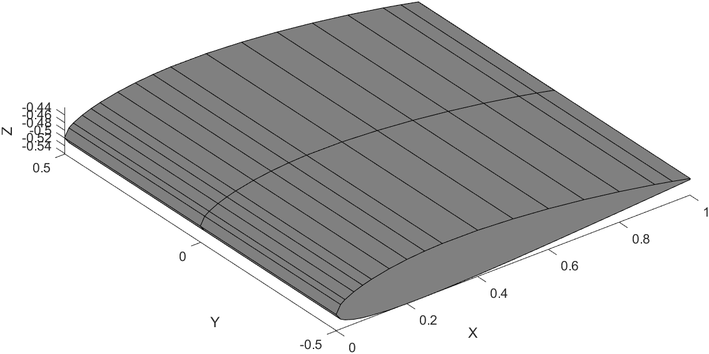
</div>

Here is a snippet of the code that draws one segment of the wing.

```matlab

for t = 1:airfoil_size(1)
    if t <= airfoil_size(1) - 1
        XWRT = [((airfoil_coords_x(t) + XW1) * c) - c, ((airfoil_coords_x(t).* tp + XW2) * c) - c,...
            ((airfoil_coords_x(t + 1).* tp + XW2) * c) - c, ((airfoil_coords_x(t + 1) + XW1) * c) - c];
        YWRT = [(airfoil_array(1)), (airfoil_array(1) + b / 2), (airfoil_array(1) + b / 2), (airfoil_array(1))];
        ZWRT = [((airfoil_coords_y(t) + ZW1) * c) - c, ((airfoil_coords_y(t).* tp + ZW2) * c) - c,...
            ((airfoil_coords_y(t + 1).* tp + ZW3) * c) - c, ((airfoil_coords_y(t + 1) + ZW4) * c) - c];
        WRT  = fill3(XWRT, YWRT, ZWRT, [0.5 0.5 0.5]);
        t = t + 1;
    end
end

```
Now all of this is simple to understand and use. You want to plot a wing, input the airfoil coordinates and you're done. The problem is what if you want to plot a wing with a different airfoil for the root and tip? If the number of points in both airfoils are the same, then it's no big deal, it works the same way. However, what if the tip airfoil has more points than the root airfoil, or vice versa? 

Suppose we wish to create a wing with a NACA 2412 airfoil for the root and a NACA 63(1)-212 airfoil for the tip. The 2412 has 35 points along it's cross-section, while the 63(1)-212 has 141.
<div>
    <iframe type="text/html" src="naca2412.html" width="150" height="3200"></iframe>
    <iframe type="text/html" src="NACA63-212.html" width="150" height="3200"></iframe>
</div>

<div>
    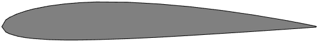
    NACA 2412
    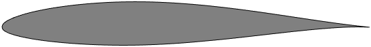
    NACA 63(1)-212
</div>

The difficulty is in how an airfoil is constructed. What you need to do then is increase the size of the array of the NACA 2412 airfoil to equal the NACA 63(1)-212. The problem is ensuring that the increased array is the same geometric shape and size as a standard NACA 2412. Each point that is added to the 2412 airfoil has to be at the same X-Axis location as the 63(1)-212 airfoil for MATLAB to plot a face connecting those segments as shown in the above steps. Enlarging the 2412 is straightforward enough, just increase the size of the array and ensure the Y-Axis points correspond to the correct X-Axis points. Once you have this enlarged array, you need to fill in the X-Axis location gaps (gaps because the 2412 has X-Axis points from 0.9, 0.95, 1 while the 63(1)-212 has X-Axis points from 0.968..., 0.987..., 1) with the points from the 63(1)-212. 

The tricky part is that for each of these extra filled in points, you need to calculate the corresponding Y-Axis point that still fits geometrically with the original airfoil. You can do this by calculating the slope of the corresponding segment as, m = (y2 - y1) / (x2 - x1), where m is the slope of the segment and y2 and y1 are the Y-Axis points and x2 and x1 are the X-Axis points respectively. Also knowing the slopes of each segment isn't enough, you also need to know it's position on the airfoil. In other words, the slope is found from the local coordinates between each segment, you also need the global coordinates of the full airfoil to understand where to place the Y-Axis point for each X-Axis point that was filled in.


Finally, this process needs to be completed for both airfoils, to ensure that their X-Axis points line up and the Y-Axis points are in the correct location. After this is complete, the full wing can be plotted.

The following snippets of code are the MATLAB implementations of the process described above.

Code that fills in gaps after smaller airfoil is enlarged.

```matlab
        % Following code places all of the original airfoil Y-Axis points
        % on the new combined airfoil X-Axis points. The location of each
        % Y-Axis point is the same as that of the original airfoil,
        % ensuring that the new combined airfoil is the same geometrically
        % as the original just a larger array
        
        % Initialize necessary arrays
        comboAirfoilSize       = length(comboAirfoil_coords_xRoot);
        findYLocationArrayRoot = zeros(airfoil_sizeRoot,1);
        rearrangedYArray       = zeros(comboAirfoilSize,1);
        midpointRoot           = find(airfoil_coords_xRoot == min(airfoil_coords_xRoot));
        midpointCombo          = find(comboAirfoil_coords_xRoot == min(comboAirfoil_coords_xRoot));
        
        % Arrange the Y-cordinate points according to the order that they
        % were on the original airfoil
        for iRoot = 1:airfoil_sizeRoot(end)
            intermediateArrayRoot = find(comboAirfoil_coords_xRoot == airfoil_coords_xRoot(iRoot));
            if length(intermediateArrayRoot) > 1
                if intermediateArrayRoot(1) == iRoot == false && iRoot < midpointRoot == true ||...
                        intermediateArrayRoot(end) == iRoot == false && iRoot < midpointRoot == true
                    intermediateArrayRoot(end) = [];
                    findYLocationArrayRoot(iRoot) = intermediateArrayRoot;
                elseif intermediateArrayRoot(1) == iRoot == false && iRoot > midpointRoot == true ||...
                        intermediateArrayRoot(end) == iRoot == false && iRoot > midpointRoot == true
                    intermediateArrayRoot(1) = [];
                    findYLocationArrayRoot(iRoot) = intermediateArrayRoot;
                else
                    intermediateArrayRoot(end) = [];
                    findYLocationArrayRoot(iRoot) = intermediateArrayRoot;
                end                
            else
                findYLocationArrayRoot(iRoot) = intermediateArrayRoot;
            end
            
                if length(find(findYLocationArrayRoot == intermediateArrayRoot)) > 1      
                    tempFind = find(findYLocationArrayRoot == intermediateArrayRoot);
                    findYLocationArrayRoot(iRoot) = tempFind(end);
                else
                    findYLocationArrayRoot(iRoot) = find(findYLocationArrayRoot == intermediateArrayRoot);
                end
                
                if iRoot ~= 1 && iRoot < midpointRoot && length(find(comboAirfoil_coords_xRoot == airfoil_coords_xRoot(findYLocationArrayRoot(iRoot)) == 1)) > 1
                    findYSortedRoot = comboAirfoil_coords_xRoot(1:midpointCombo) == airfoil_coords_xRoot(findYLocationArrayRoot(iRoot));
                    extraZeros  = false(comboAirfoilSize-length(findYSortedRoot),1);
                    if isempty(extraZeros) == 1
                        extraZeros = 0;
                    end
                    findYSortedRoot = [findYSortedRoot;extraZeros];
                elseif iRoot ~= 1 && iRoot > midpointRoot && length(find(comboAirfoil_coords_xRoot == airfoil_coords_xRoot(findYLocationArrayRoot(iRoot)) == 1)) > 1
                    
                    findYSortedRoot = comboAirfoil_coords_xRoot(midpointCombo:end) == airfoil_coords_xRoot(findYLocationArrayRoot(iRoot));
                    extraZeros  = false(comboAirfoilSize-length(findYSortedRoot),1);
                    findYSortedRoot = [extraZeros;findYSortedRoot];
                else
                    findYSortedRoot = comboAirfoil_coords_xRoot == airfoil_coords_xRoot(findYLocationArrayRoot(iRoot));
                end
                
            if length(find(comboAirfoil_coords_xRoot == 0)) > 1
                for j = 1:airfoil_sizeRoot(end)
                     if findYSortedRoot(j) ~= 1
                         findYSortedRoot(j) = 0;
                     else
                         findYSortedRoot(j) = 1;
                     end
                end
            end
            % Final array that includes all of the original Y-Axis points
            % on the correct X-Axis points (includes empty spots)
            rearrangedYArray(findYSortedRoot) = airfoil_coords_yRoot(findYLocationArrayRoot(iRoot));
        end
```

Code that calculates the slope of each segment and location of each segment on airfoil.

```matlab
% Next we need to determine the slope of each segment of the airfoil. This
% is accomplished by finding all of the empty spots on the rearrangedYArray
% array. The empty spots are for all of the points that are added in to
% increase the size of the array so that each array (root and tip) are the
% same size.

% Once all of the empty spots are found then need to increment above and
% below that empty spot to find the two X-Axis and Y-Axis points to input
% into the slope formula: m = (y2-y1)/(x2-x1).

% Initialize values
findEmptySpots      = find(rearrangedYArray == 0);
emptySpotsSlopeRoot = zeros(length(findEmptySpots),1);
incBack             = 1;
incFront            = 1;

% Determine if start incrementing at the first or second value. If the
% first value in the array is a zero then start incrementing at 2 otherwise
% start at 1
iTestStart = findEmptySpots(1)-incBack;
if iTestStart == 0
    iStart = 2;
else
    iStart = 1;
end

% Determine if end incrementing at the last or second to last value. If the
% end value in the array is a zero then end incrementing at 1 otherwise end
% at 0
iTestEnd = findEmptySpots(end)+incFront;
if iTestEnd > length(rearrangedYArray)
    iEnd = 1;
else
    iEnd = 0;
end

% Grab the first and last values of the Y-Axis array
checkOriginRootStart = airfoil_coords_yRoot(1);
checkOriginRootEnd   = airfoil_coords_yRoot(end);
    
% Determine if need to adjust increment values along the empty spots. If
% the gap between an empty spot is greater than 2, in other words if the
% above and below value of an empty spot is zero then need to adjust the
% increment to find a value that is closet to the empty spot and is
% nonzero.
for i = iStart:length(findEmptySpots)-iEnd
        incBack  = 1;
        incFront = 1;
        backValue  = rearrangedYArray(findEmptySpots(i)-incBack);
        frontValue = rearrangedYArray(findEmptySpots(i)+incFront);
        
        % Find nonzero values above the empty spot
        if backValue == 0
            for incBack = 1:20
                if findEmptySpots(i)-incBack <= 0
                    incBack = incBack - 1;
                    break
                end
                backValue = rearrangedYArray(findEmptySpots(i)-incBack);
                if backValue ~= 0
                    break
                elseif findEmptySpots(i)-incBack == midpointCombo
                    break
                elseif rearrangedYArray(findEmptySpots(i)-incBack) == checkOriginRootStart && i == iStart
                    break
                else
                    continue
                end
            end
        end
        
        % Find nonzero values below the empty spot
        if frontValue == 0
            for incFront = 1:20
                if findEmptySpots(i)+incFront == length(rearrangedYArray)
                    break
                elseif findEmptySpots(i)+incFront > length(rearrangedYArray)
                    frontValue = frontValue - 1;
                    break
                end
                frontValue = rearrangedYArray(findEmptySpots(i)+incFront);
                if frontValue ~= 0
                    break
                elseif findEmptySpots(i)+incFront == midpointCombo
                    break
                elseif rearrangedYArray(findEmptySpots(i)+incFront) == checkOriginRootEnd && i == length(findEmptySpots)-iEnd
                    break
                else
                    continue
                end
            end
        end
        
    % Calculates slope across the empty spot
    if findEmptySpots(i) == midpointCombo
        emptySpotsSlopeRoot(i) = 0;
    else
        emptySpotsSlopeRoot(i) = (rearrangedYArray(findEmptySpots(i) + incFront)...
            - rearrangedYArray(findEmptySpots(i) - incBack)) / (comboAirfoil_coords_xRoot(findEmptySpots(i)...
            + incFront) - comboAirfoil_coords_xRoot(findEmptySpots(i) - incBack));
    end
end

% Calculates the empty spot value based on the slope across the empty spot
% and the nearest nonzero value.
for i = iStart:length(findEmptySpots)-iEnd
        rearrangedYArray(findEmptySpots(i)) = rearrangedYArray(findEmptySpots(i)-1) +...
            emptySpotsSlopeRoot(i) .* (comboAirfoil_coords_xRoot(findEmptySpots(i)) - comboAirfoil_coords_xRoot(findEmptySpots(i)-1));
        
        if findEmptySpots(i) == midpointCombo
            rearrangedYArray(findEmptySpots(i)) = 0;
        end
end

% Sets the final combined airfoil Y-Axis array to the final
% rearrangedYArray array (empty spots are filled in)
comboAirfoil_coords_yRoot = rearrangedYArray;
```

Here are the finished airfoils for the root and tip, the NACA 2412 and NACA 63(1)-212.

<div>
<iframe type="text/html" src="combo_naca2412.html" width="150" height="3200"></iframe>

<iframe type="text/html" src="combo_naca63-212.html" width="150" height="3200"></iframe>
</div>

Finally, here is the code that plots the wing. Note how rather then using a FOR loop to create the wing by drawing a face connecting both segments together on the root and tip, a surface function is used which creates the wing by lofting a surface between the root and tip airfoils.  The above process still holds true, where the X-Axis points need to be in the same location across the root and tip for the loft to work. A FOR loop would still work, but a surface is faster and also allows for shading the model. I showed the steps of using a FOR loop to help better understand the overall process.


```matlab
% X-Coordinates
XW1 = 0;
XW2=XW1 + (b/2)*tand(LamLE);
XW3=XW2+tipChord;
XW4=XW1+rootChord;

% Z-Coordinates
ZW1=rootChord*sind(i_w);
ZW2=(XW4-XW2)*sind(i_w)+(b/2)*tand(Gam);
ZW3=(XW4-XW3)*sind(i_w)+(b/2)*tand(Gam);

XWRRoot = ((comboAirfoil_coords_xRoot).*rootChord)+XW1;
XWRTip  = ((comboAirfoil_coords_xTip.*tipChord)+XW2);

YWRT = zeros(length(XWRRoot),2);

ZWRRoot = ((comboAirfoil_coords_yRoot).*rootChord)+ZW1;
ZWRTip = ((comboAirfoil_coords_yTip).*tipChord)+ZW2;

YWRT(:,1) = 0;
YWRT(:,2) = b/2-((b/2)-(b/2)*cosd(Gam));
XWRT = [XWRRoot,XWRTip];
ZWRT = [ZWRRoot,ZWRTip];

% Plot Right Wing
WRT = surface(XWRT,YWRT,ZWRT);
```

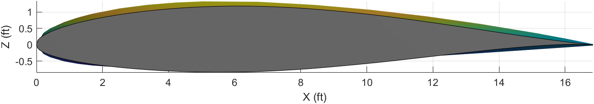
Combined airfoils: NACA 2412 and NACA63(1)-212
