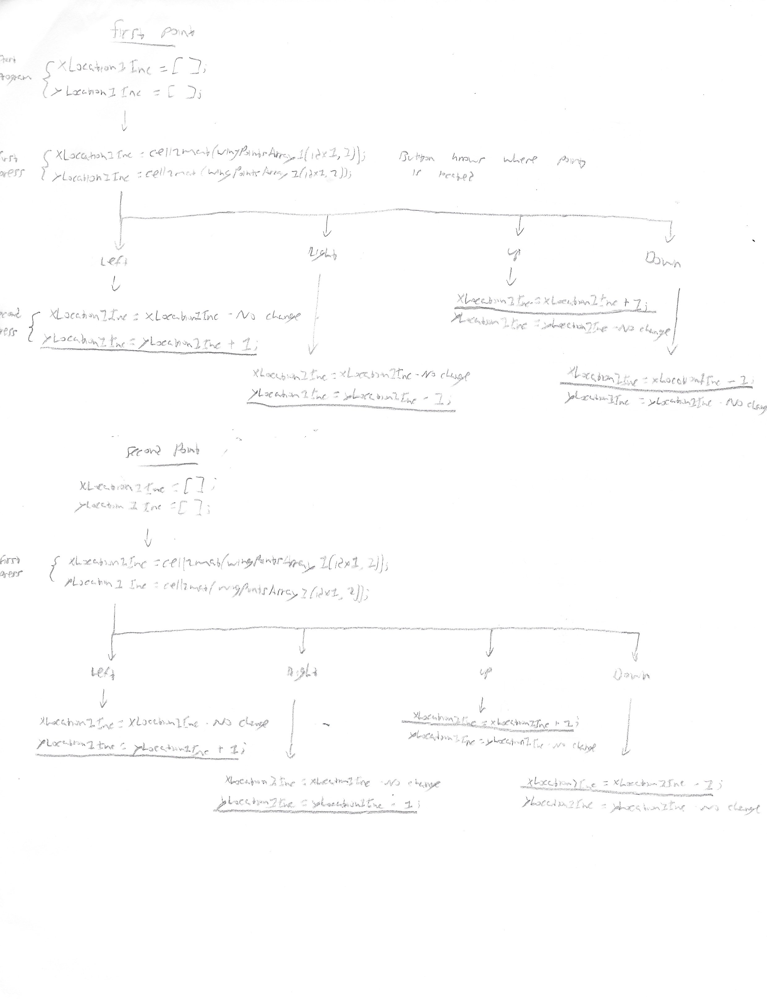
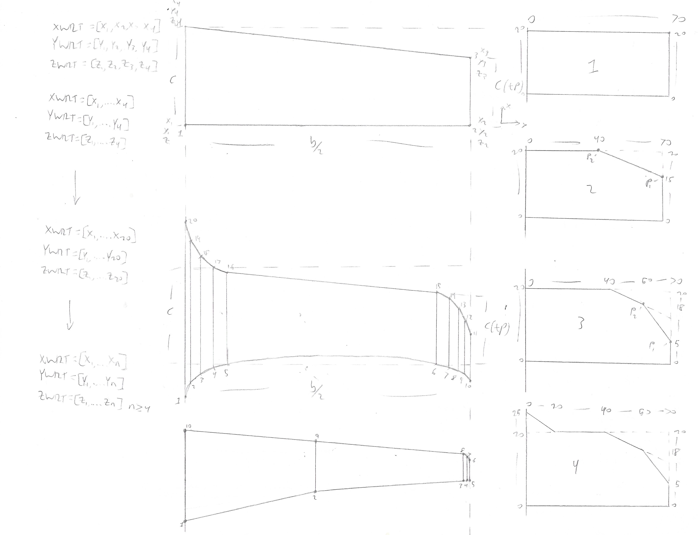
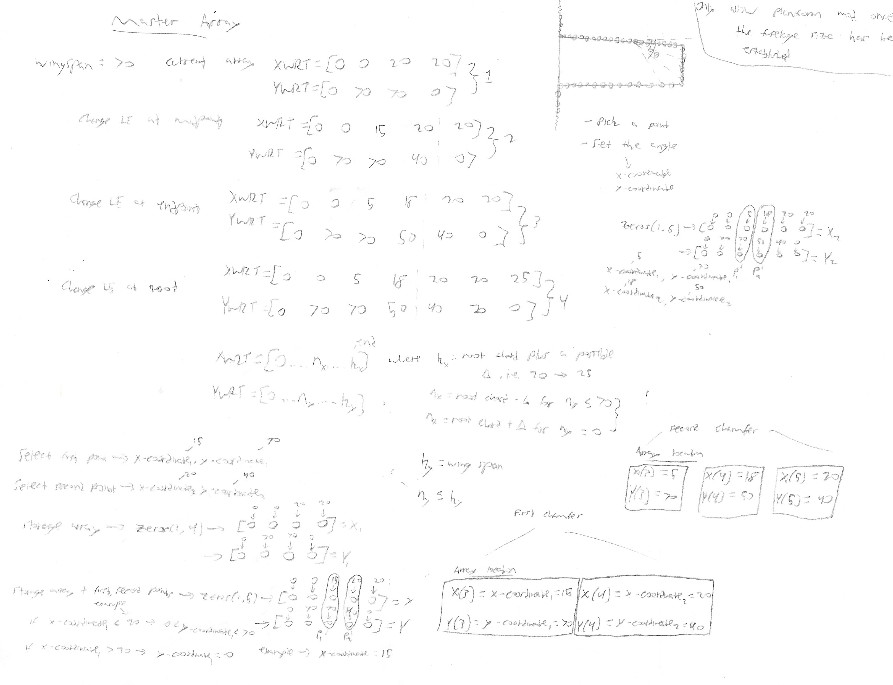
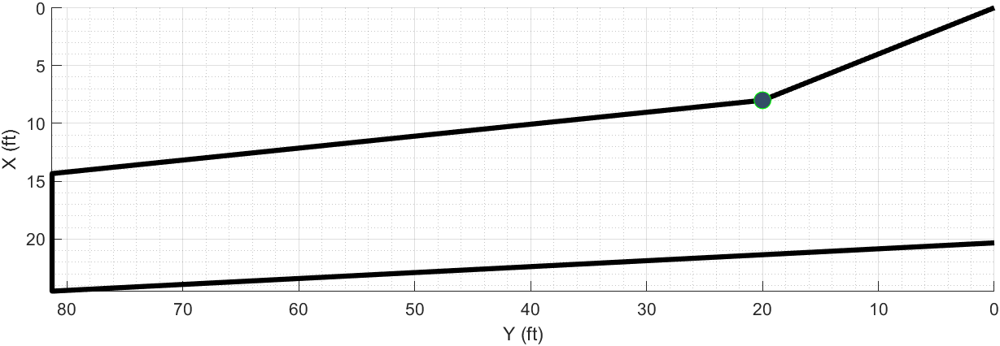
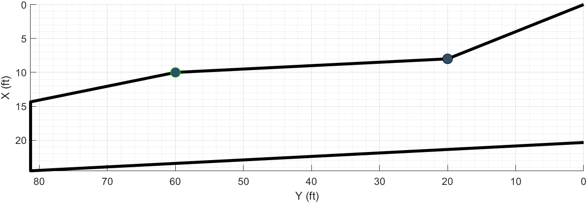
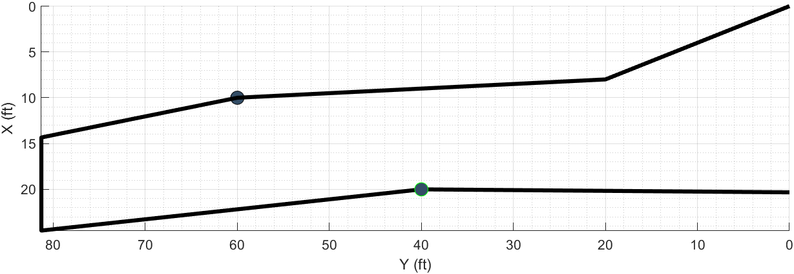
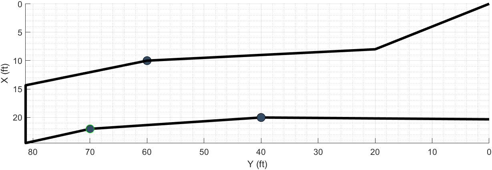

<h3>Wing Planform Modification Code</h3>

The second, the ability to create a multi segment wing was also fairly complex. The biggest problem I faced with writing the wing segment code was in reordering the points of each segment. The problem essentially revolves around matrix manipulation. Everytime a point is laid down for a new segment, it's position along the wingspan needs to be stored so that the wing is remodeled with the correct number of segments. 

Similar to how MATLAB plotted the wing with a FOR loop from the <b>Airfoil</b> code, four points are needed to complete a wing segment. Therefore, if a single point is placed along the leading edge of the wing, a similar point needs to be placed at the same location along the span on the trailing edge. This ensures MATLAB can build the wing with two complete segments. 

The sketches below are the basic theories behind this process.




Below is the code that follows the idea laid out from the sketches above. It reorders the points for each segment and determines the slope of each segment to determine the modeling of a complex multi-segment wing.

<h4>Wing Planform Code</h4>
Following code snippet assumes that points have been placed on both the leading and trailing edges, that way it won't encounter problems with empty arrays. If points are only placed along the leading or trailing edge, not both, a code snippet below this is run.

```matlab
% Wing Preview
%--------------------------------------------------------------------------
% The following code is quite involved, but it solves a fairly complex
% problem. Adding points to only the leading edge or the trailing edge is
% quite easy, all you need to do is ensure that they are in the correct
% order to build the final wing. Unfortunately, when you add points to both
% the leading and trailing edge it becomes much more complex. 

% For example say you add two points to the leading edge, so now the wing
% is broken up into three sections. Then you add a point to the trailing
% edge that is in between those two leading edge points. Now to construct
% the wing correctly you need to calculate the slope created by those two
% leading edge points and then, the difficult part, essentially mirror the
% trailing edge point to the leading edge to create another wing segment
% between the current three segments.

% The problem only becomes more complex when you want to modify those
% points by moving them along the span. Then you have to reorder every
% point correctly, and create the wing segments in the correct order.
%--------------------------------------------------------------------------

% To begin we need to determine if we need to create an extra wing segment
% or not based on whether we have a point placed on either the root chord
% or tip chord 

% If a point is placed on either the root or tip chord set addOn to 0
if isempty(yLocationInc) ~= 1 && yLocationInc == 0 || isempty(yLocationInc) ~= 1 && yLocationInc == (b/2)
    addOn = 0;
else
    addOn = 1;
end

% If one of the points on the leading edge is on the tip chord set addOn to
% 0
if isempty(storageArrayP1) ~= 1 && max(tempStorageArrayY1) == b/2
    addOn = 0;
else
    addOn = 1;
end

% Initialize subarrays of XWRTMainC and YWRTMainC which is the completed
% arrays for housing all of the leading and trailing edge points

    % Find where the maximum and min points are along the leading edge and
    % store them in XWRTMainC and YWRTMainC and set them to a Find.
    [~,findMaxLEPoints] = find(YWRTMainC == max(YWRTMainC));
    [~,findMinLEPoints] = find(YWRTMainC == min(YWRTMainC));
    findMaxLEPoints = min(findMaxLEPoints);
    findMinLEPoints = min(findMinLEPoints);

    % Find where the maximum and min points are along the trailing edge and
    % store them in XWRTMainC and YWRTMainC and set them to a Find.
    [~,findMaxTEPoints] = find(YWRTMainC == max(YWRTMainC));
    [~,findMinTEPoints] = find(YWRTMainC == min(YWRTMainC));
    findMaxTEPoints = max(findMaxTEPoints);
    findMinTEPoints = max(findMinTEPoints);

    % Create subarrays for the X-Axis and Y-Axis along the leading edge of the
    % main arrays
    XWRTMainLE = XWRTMainC(findMinLEPoints:findMaxLEPoints);
    YWRTMainLE = YWRTMainC(findMinLEPoints:findMaxLEPoints);

    % Create subarrays for the X-Axis and Y-Axis along the trailing edge of the
    % main arrays
    XWRTMainTE = XWRTMainC(findMaxTEPoints:findMinTEPoints);
    YWRTMainTE = YWRTMainC(findMaxTEPoints:findMinTEPoints);

    % Leading Edge
    % Determine the slope of each wing segment created by adding a point
    if isempty(storageArrayP1) ~= 1 && addOn > 0
        slopeLEArray = zeros(1,storageArrayP1(end)+addOn);
        for num = 1:storageArrayP1(end)+addOn
            slopeLEArray(num) = (XWRTMainLE(num+addOn) - XWRTMainLE(num))/(YWRTMainLE(num+addOn) - YWRTMainLE(num));
        end
        [~,findBehindPointLE] = find(tempStorageArrayYSort1 <= yLocationInc);
        if isempty(findBehindPointLE) == 1
            findBehindPointLE = 1;
        end
    else
        slopeLEArray = (XWRTMainLE(2) - XWRTMainLE(1))/(YWRTMainLE(2) - YWRTMainLE(1));
        findBehindPointLE       = 1;
    end

    % Trailing Edge
    % Determine the slope of each wing segment created by adding a point
    if isempty(storageArrayP2) ~= 1 && addOn > 0
        slopeTEArray = zeros(1,storageArrayP2(end)+addOn);
        for num = 1:storageArrayP2(end)+addOn
            slopeTEArray(num) = (XWRTMainTE(num+addOn) - XWRTMainTE(num))/(YWRTMainTE(num+addOn) - YWRTMainTE(num));
        end
        [~,findBehindPointTE] = find(tempStorageArrayYSort2 <= yLocationInc);
        if isempty(findBehindPointTE) == 1
            findBehindPointTE = 1;
        end
    else
        slopeTEArray = (XWRTMainTE(end) - XWRTMainTE(end-1))/(YWRTMainTE(end) - YWRTMainTE(end-1));
        findBehindPointTE     = 1;
    end

        if isempty(storageArrayP1) == 1
            storageArrayP1 = 0;
        elseif isempty(storageArrayP2) == 1
            storageArrayP2 = 0;
        end
        
        numWingSegments = storageArrayP1(end) + storageArrayP2(end) + addOn;
        
        tpArray               = zeros(1,numWingSegments);
        
        % Now create a loop to gradually build up the wing for each wing
        % segment. This is where it gets fun.
        for i = 2:numWingSegments + addOn
            
            if tempStorageArrayXSort1 == 0
                tempStorageArrayXSort1 = [];
            end
            
            if tempStorageArrayYSort1 == 0
                tempStorageArrayYSort1 = [];
            end
            
            if tempStorageArrayXSort2 == 0
                tempStorageArrayXSort2 = [];
            end
            
            if tempStorageArrayYSort2 == 0
                tempStorageArrayYSort2 = [];
            end
            
            % We need an array to partition all of the leading edge points
            % as well as the ones created by the trailing edge modification
            combinedLEArrayPointsX = [XWRTMainLE tempStorageArrayXSort2];
            combinedLEArrayPointsY = [YWRTMainLE tempStorageArrayYSort2];
            combinedTEArrayPointsX = [XWRTMainTE tempStorageArrayXSort1];
            combinedTEArrayPointsY = [YWRTMainTE tempStorageArrayYSort1];
            
            if isempty(tempStorageArrayXSort1) == 1
                tempStorageArrayXSort1 = 0;
            end
            
            if isempty(tempStorageArrayYSort1) == 1
                tempStorageArrayYSort1 = 0;
            end
            
            if isempty(tempStorageArrayXSort2) == 1
                tempStorageArrayXSort2 = 0;
            end
            
            if isempty(tempStorageArrayYSort2) == 1
                tempStorageArrayYSort2 = 0;
            end

            % Begin looping across all of the inputted trailing edge points
            for jj = 1:length(tempStorageArrayXSort2)

               % Find where the trailing edge points are stored in the
               % combined array housing all of the leading and trailing
               % edge points
               if tempStorageArrayXSort1 ~= 0
                   findLEXPoints = find(combinedLEArrayPointsX == tempStorageArrayXSort2(jj));
               else
                   findLEXPoints = [];
               end
               
               findLEXPoints = find(combinedLEArrayPointsX == tempStorageArrayXSort2(jj));
               
               % Rearrange the Y Sort array in descending order
               rearrangedYSort1 = sort(tempStorageArrayYSort1,'descend');

               % Initialize two arrays for rearranging the X-coordinate points in
               % the correct order
               findYLocationArray = zeros(length(tempStorageArrayXSort1),1);
               rearrangedXArray   = zeros(length(tempStorageArrayXSort1),1);

               % Arrange the X-coordinate points according to the order that they
               % were inputted along with the rearranged Y-coordinate
               % points
               for n = 1:length(tempStorageArrayXSort1)
                   intermediateArray = find(tempStorageArrayYSort1 == tempStorageArrayYSort1(n));
                    if length(intermediateArray) > 1
                        findFirstValue = intermediateArray == n;
                        findSecondValue = findFirstValue == 0;
                        intermediateArray(findSecondValue) = [];
                        findYLocationArray(n) = intermediateArray;
                    else
                        findYLocationArray(n) = intermediateArray;
                    end
                   findYLocationArray(n) = find(findYLocationArray == n);
                   findYSorted = rearrangedYSort1 == tempStorageArrayYSort1(findYLocationArray(n));
                   rearrangedXArray(findYSorted) = tempStorageArrayXSort1(findYLocationArray(n));
                end
                rearrangedXSort1 = rearrangedXArray';

                % Find where the trailing edge point is greater than the
                % leading edge points. If it isn't then set the Find to 0
                for inc1 = 1:length(tempStorageArrayYSort1)
                    if tempStorageArrayYSort2(jj) > rearrangedYSort1(inc1)
                        findSlopeLEPoint1 = inc1;
                        break
                    else
                        findSlopeLEPoint1 = 0;
                    end
                end

                % Find where the trailing edge point is less than the
                % leading edge points. If it isn't then set the Find to 0
                for inc2 = 1:length(tempStorageArrayYSort1)
                    if tempStorageArrayYSort2(jj) < tempStorageArrayYSort1(inc2)
                        findSlopeLEPoint2 = inc2;
                        break
                    else
                        findSlopeLEPoint2 = 0;
                    end
                end

                % If the first Find is greater than the second Find, set
                % the maxPoint to the first Find and set the substitute
                % arrays to the rearranged arrays. If it isn't then do the
                % opposite and set the substitute arrays to the regular Sort
                % arrays
                if findSlopeLEPoint1 > findSlopeLEPoint2
                    maxPointLE = findSlopeLEPoint1;
                    substituteXArray = rearrangedXSort1;
                    substituteYArray = rearrangedYSort1;
                elseif findSlopeLEPoint2 > findSlopeLEPoint1
                    maxPointLE = findSlopeLEPoint2;
                    substituteXArray  = tempStorageArrayXSort1;
                    substituteYArray  = tempStorageArrayYSort1;
                else
                    maxPointLE = findSlopeLEPoint1;
                    substituteXArray = rearrangedXSort1;
                    substituteYArray = rearrangedYSort1;
                end

                if storageArrayP2(end) ~= 0 && storageArrayP1(end) == 0
                    maxPointLE = findSlopeLEPoint1;
                    substituteXArray = min(XWRTMainLE);
                    substituteYArray = min(YWRTMainLE);
                end
                
               % Determine what wing segments and subsequent slopes the
               % trailing edge points are under
               for count = storageArrayP1(end)+addOn:-1:1
                   if count > 1 && tempStorageArrayYSort2(jj) > tempStorageArrayYSort1(count-addOn)
                       slopeLEPoint = slopeLEArray(count);
                       break
                   elseif tempStorageArrayYSort2(jj) < tempStorageArrayYSort1(1)
                       slopeLEPoint = slopeLEArray(1);
                       break
                   else
                       slopeLEPoint = slopeLEArray;
                   end
               end

               % Here's the important part, for the trailing edge point found 
               % in the combined array determine its new X-Coordinate due to being
               % translated(mirrored) to the leading edge
                if isempty(findLEXPoints) ~= 1
                    combinedLEArrayPointsX(findLEXPoints) = (tempStorageArrayYSort2(jj)...
                        - substituteYArray(maxPointLE)) * slopeLEPoint + substituteXArray(maxPointLE);
                end
            end

            % Set the combined array to a new sorter array name
            pointLE = combinedLEArrayPointsX;
```  

For brevity, I removed the trailing edge code as it is identical to the leading edge code.

```matlab
            .
            .
            .
            % Arrange the Y-coordinate points in decreasing order
            sortedLEPointsY = sort(combinedLEArrayPointsY);

            % Initialize two arrays for rearranging the X-coordinate points in
            % the correct order
            findYLocationArray = zeros(length(pointLE),1);
            rearrangedXArray   = zeros(length(pointLE),1);

            % Arrange the X-coordinate points according to the order that they
            % were inputted
            for m = 1:length(combinedLEArrayPointsX)
                intermediateArray = find(combinedLEArrayPointsY == combinedLEArrayPointsY(m));
                if length(intermediateArray) > 1
                    findFirstValue = intermediateArray == m;
                    findSecondValue = findFirstValue == 0;
                    intermediateArray(findSecondValue) = [];
                    findYLocationArray(m) = intermediateArray;
                else
                    findYLocationArray(m) = intermediateArray;
                end
                findYLocationArray(m) = find(findYLocationArray == m);
                findYSorted = sortedLEPointsY == combinedLEArrayPointsY(findYLocationArray(m));
                rearrangedXArray(findYSorted) = combinedLEArrayPointsX(findYLocationArray(m));
            end
            sortedLEPointsX = rearrangedXArray;

            % Initialize two arrays for rearranging the X-coordinate points in
            % the correct order
            findYLocationArray = zeros(length(pointTE),1);
            rearrangedXArray   = zeros(length(pointTE),1);

            % Arrange the X-coordinate points according to the order that they
            % were inputted
            for m = 1:length(combinedTEArrayPointsX)
                intermediateArray = find(combinedTEArrayPointsY == combinedTEArrayPointsY(m));
                if length(intermediateArray) > 1
                    findFirstValue = intermediateArray == m;
                    findSecondValue = findFirstValue == 0;
                    intermediateArray(findSecondValue) = [];
                    findYLocationArray(m) = intermediateArray;
                else
                    findYLocationArray(m) = intermediateArray;
                end
                findYLocationArray(m) = find(findYLocationArray == m);
                findYSorted = sortedLEPointsY == combinedTEArrayPointsY(findYLocationArray(m));
                rearrangedXArray(findYSorted) = combinedTEArrayPointsX(findYLocationArray(m));
            end
            sortedTEPointsX = rearrangedXArray;
            
            tpArray(i) = (pointTE(i) - pointLE(i)) / rootChord;
            tpSub = sort(tpArray(2:end),'descend');
            tpArray = [0 tpSub];
        end
        
        % Determine taper of each segment
        tpArray = (sortedTEPointsX' - sortedLEPointsX') / rootChord;
        
        if storageArrayP1 == 0
            storageArrayP1 = [];
        elseif storageArrayP2 == 0
            storageArrayP2 = [];
        end
        
        % Initialize array for final storage of leading edge points
        sorted_airfoil_coords_xLE = zeros(comboAirfoilSize(1),length(pointLE));
        
        % Create array of final leading edge points 
        airfoil_coords_xLE = comboAirfoil_coords_xRoot * rootChord * tpArray + sortedLEPointsX';
            
        % Cut the above array in half to only look at the top surface first
        sub_airfoil_coords_xLE = airfoil_coords_xLE(ceil(comboAirfoilSize(1)/2),:);

        findLEPointsX = zeros(1,length(pointLE));
        
        % Determine the final position of the leading edge points
        for inc = 1:length(pointLE)
            findLEPointsX(inc) = find(sub_airfoil_coords_xLE(inc) == sortedLEPointsX, 1 );
            sorted_airfoil_coords_xLE(:,inc) = airfoil_coords_xLE(:,findLEPointsX(inc));
        end
        
        % Set airfoil_coords_xLE to sorted_airfoil_coords_xLE variable
        airfoil_coords_xLE = sorted_airfoil_coords_xLE;
        
        % Wing Area
        wingArea = (b/2)*c*(1+tp);
        
        % Wing Aspect Ratio
        ARWing = b^2/wingArea;

       % X-Coordinates
        XW1=1;
        XW2=XW1+(b/c)*tand(LamLE);
        XW4=XW1+1;

        % Z-Coordinates
        ZW2=1/2+(XW4-XW2)*sind(i_w)+(ARWing)*tand(Gam);
        
        xCoordsBoth = airfoil_coords_xLE;
        yCoordsBoth = (ones(comboAirfoilSize(1),1).*sortedLEPointsY(1:i));
        zCoordsMid = (comboAirfoil_coords_yRoot.*(ones(1,numWingSegments+addOn)+ZW2).*rootChord*tp);
        zCoordsEnd  = (comboAirfoil_coords_yTip.*rootChord*tp);
        zCoordsBoth = [zCoordsMid(:,1:end-1), zCoordsEnd];
     
        if storageArrayP1 == 0
            storageArrayP1 = [];
        end
        
        if storageArrayP2 == 0
            storageArrayP2 = [];
        end
        
        if tempStorageArrayXSort1 == 0
            tempStorageArrayXSort1 = [];
        end

        if tempStorageArrayYSort1 == 0
            tempStorageArrayYSort1 = [];
        end

        if tempStorageArrayXSort2 == 0
            tempStorageArrayXSort2 = [];
        end

        if tempStorageArrayYSort2 == 0
            tempStorageArrayYSort2 = [];
        end
```        
Following code snippet is for if a point is the first one placed on either the leading or trailing edge. The issue with the above code is that assumes a nonempty array for both leading and trailing edge points. Therefore, need to only manipulate arrays for only leading edge points or for only trailing edge points, not both.

```matlab
if isempty(storageArrayP1) == 1 && isempty(storageArrayP2) == 1    
    switch(lineSelected)
        %% 1 Leading Edge Modification
        case 1
    if isempty(storageArrayP1) ~= 1
        yLocationFirstWS    = zeros(1,storageArrayP1(end));
        xLocationFirstWSLES = zeros(1,storageArrayP1(end));
        firstWSChord        = zeros(1,storageArrayP1(end));
        tpWS                = zeros(1,storageArrayP1(end));
    else
        yLocationFirstWS    = 0;
        xLocationFirstWSLES = 0;
        firstWSChord        = 0;
        tpWS                = 0;
        storageArrayP1      = 0;
    end
        airfoil_coords_xLE  = zeros(comboAirfoilSize(1),storageArrayP1(end)+addOn);

        if isempty(storageArrayP2) == 1
            incrementSlope = 1;
        else
            incrementSlope = storageArrayP2;
        end       
        
            for j = 1:incrementSlope(end)
                for i = 1:storageArrayP1(end)+addOn
                    upperAirfoilCoordsXLE = zeros(comboAirfoilSize(1),storageArrayP1(end)+addOn);
                    lowerAirfoilCoordsXLE = zeros(comboAirfoilSize(1)+1,storageArrayP1(end)+addOn);
                    
                    % Y-Location of end of first wing segment
                    yLocationFirstWS(i) = slopeTEArray(findBehindPointTE(j))*YWRTMainLE(i+1) + rootChord;
                    
                    % X-Location accounting for LE sweep
                    xLocationFirstWSLES(i) = yLocationFirstWS(i);

                    % Subtract LE point 
                    firstWSChord(i) = xLocationFirstWSLES(i) - XWRTMainLE(i+1);

                    % Taper of wing segment
                    tpWS(i) = firstWSChord(i)/rootChord;

                    % Set up airfoil coordinates for each wing segment
                    airfoil_coords_xLE(:,i) = (yLocationFirstWS(i) - comboAirfoil_coords_xRoot*rootChord*tpWS(i));
                        
                    % Need to separate airfoil_coords_xLE into a upper and lower
                    % section and then invert them and put the whole array back
                    % together
                    [maxAirfoilCoordsXLE_Val,maxAirfoilCoordsXLE_Loc]   = max(airfoil_coords_xLE(:,i));
                    upperAirfoilCoordsXLE(1:maxAirfoilCoordsXLE_Loc,i) = airfoil_coords_xLE(1:maxAirfoilCoordsXLE_Loc,i);
                    lowerAirfoilCoordsXLE(maxAirfoilCoordsXLE_Loc+2:end,i) = airfoil_coords_xLE(maxAirfoilCoordsXLE_Loc+1:end,i);
                    
                    % Find zeros
                    findZerosUpper = upperAirfoilCoordsXLE == 0;
                    findZerosLower = lowerAirfoilCoordsXLE == 0;
                    
                    % Erase zeros
                    upperAirfoilCoordsXLE(findZerosUpper) = [];
                    lowerAirfoilCoordsXLE(findZerosLower) = [];
                    
                    % Add in max point so that the upper and lower are same
                    lowerAirfoilCoordsXLE = [maxAirfoilCoordsXLE_Val lowerAirfoilCoordsXLE];
                    
                    % Erase last point on lowerAirfoilCoordsXLE otherwise
                    % we would have two, only need one
                    lowerAirfoilCoordsXLE(end) = [];
                    
                    airfoil_coords_xLE(:,i)    = [lowerAirfoilCoordsXLE upperAirfoilCoordsXLE];
    
                end
            end

        % For tip chord need to do something a little different
        tipChordPointsY = find(YWRTMainC == b/2);
        tipChordPointsX = XWRTMainC(tipChordPointsY);
        
        % Taper of tip chord
        tpTC = (tipChordPointsX(2)-tipChordPointsX(1)) / rootChord;
        
        % Airfoil coordinates of tip chord
        airfoil_coords_xEnd = comboAirfoil_coords_xRoot*rootChord*tpTC+tipChordPointsX(1);
        
        % Set up airfoil coordinates for first point
        airfoil_coords_x1 = comboAirfoil_coords_xRoot*rootChord + XWRTMainLE(1);

        if addOn == 0
            xCoordsLE = [airfoil_coords_x1, airfoil_coords_xEnd];
        else
            xCoordsLE = [airfoil_coords_x1, airfoil_coords_xLE];
        end
        
        % Build final arrays along each axis to input into surface plot
        yCoordsLE = (ones(comboAirfoilSize(1),1).*YWRTMainLE(1:i+1));
        zCoordsLERoot = comboAirfoil_coords_yRoot.*rootChord;
        zCoordsLE     = comboAirfoil_coords_yTip.*(ones(1,storageArrayP1(end)+addOn+1).*tipChord);
        zCoordsLE(:,1)    = zCoordsLERoot;
        
        
        %% Trailing Edge Modification
        case 2 

        xLocationFirstWS    = zeros(1,storageArrayP2(end));
        xLocationFirstWSLES = zeros(1,storageArrayP2(end));
        firstWSChord        = zeros(1,storageArrayP2(end));
        tpWS                = zeros(1,storageArrayP2(end));
        airfoil_coords_xTE  = zeros(comboAirfoilSize(1),storageArrayP2(end)+addOn);

        if isempty(storageArrayP1) == 1
            incrementSlope = 1;
        else
            incrementSlope = storageArrayP1;
        end

        for j = 1:incrementSlope(end)
            for i = 1:storageArrayP2(end)+addOn
                % X-Location of LE of wing segment
                xLocationFirstWS(i) = slopeLEArray(findBehindPointLE(j))*YWRTMainTE(i+1);

                % X-Location accounting for TE sweep
                xLocationFirstWSLES(i) = xLocationFirstWS(i);

                % Subtract LE point 
                firstWSChord(i) = xLocationFirstWSLES(i);
                firstWSChord(i) = XWRTMainTE(i+1) - xLocationFirstWSLES(i);

                % Taper of wing segment
                tpWS(i) = firstWSChord(i)/rootChord;

                if tpWS(i) == 0
                    tpWS(i) = 1;
                end

                % Set up airfoil coordinates for each wing segment
                airfoil_coords_xTE(:,i) = xLocationFirstWS(i) + comboAirfoil_coords_xRoot*rootChord*tpWS(i);
            end
        end
        
        % For tip chord need to do something a little different
        tipChordPointsY = find(YWRTMainC == b/2);
        tipChordPointsX = XWRTMainC(tipChordPointsY);
        
        % Taper of tip chord
        tpTC = (tipChordPointsX(2)-tipChordPointsX(1)) / rootChord;
        
        % Airfoil coordinates of tip chord
        airfoil_coords_x1 = comboAirfoil_coords_xRoot*rootChord*tpTC+tipChordPointsX(1);

        % Set up airfoil coordinates for first point
        xLocationFirstWS(3) = slopeLEArray(findBehindPointLE)*YWRTMainTE(1);

        % Build final arrays along each axis to input into surface plot
        xCoordsTE = [airfoil_coords_x1, airfoil_coords_xTE];
        yCoordsTE = (ones(comboAirfoilSize(1),1).*YWRTMainTE);
        zCoordsTERoot = comboAirfoil_coords_yRoot.*rootChord.*tp;
        zCoordsTE = comboAirfoil_coords_yTip.*(ones(1,storageArrayP2(end)+addOn+1).*rootChord*tp);
        zCoordsTE(:,1) = zCoordsTERoot;
    end
end
    
xCoords = xCoordsBoth;
yCoords = yCoordsBoth;
zCoords = zCoordsBoth;

%% ------------------------------------------------------------------------
```
Plot the final multi segment wing. If it's the first time creating the wing, no points are stored, so only need to create the wing with a single segment.

```matlab
if isempty(storageArrayP1) ~= 1 || isempty(storageArrayP2) ~= 1

    delete(wingPreviewLeft);
    delete(wingPreviewRight);
    delete(wingPreviewLeftInitial);
    delete(wingPreviewRightInitial);
    delete(rightAirfoil);
    delete(leftAirfoil);

    % Plot left wing
    wingPreviewLeft = surface(previewAxes,xCoords,yCoords,zCoords);
    wingPreviewLeft.EdgeColor = 'none';

    % Plot right wing
    wingPreviewRight = surface(previewAxes,xCoords,-yCoords,zCoords);
    wingPreviewRight.EdgeColor = 'none';
else

    % X-Coordinates
    XW1 = 0;
    XW2=XW1 + (b/2)*tand(LamLE);
    XW4=XW1+rootChord;

    % Z-Coordinates
    ZW1=rootChord*sind(i_w);
    ZW2=(XW4-XW2)*sind(i_w)+(b/2)*tand(Gam);

    XWRRoot = ((comboAirfoil_coords_xRoot).*rootChord)+XW1;
    XWRTip  = ((comboAirfoil_coords_xTip.*tipChord)+XW2);

    XWRLRoot = ((comboAirfoil_coords_xRoot).*rootChord)+XW1;
    XWRLTip = ((comboAirfoil_coords_xTip.*tipChord)+XW2);

    YWRT3 = zeros(length(XWRRoot),2);

    ZWRLRoot = ((comboAirfoil_coords_yRoot).*rootChord)+ZW1;
    ZWRLTip = ((comboAirfoil_coords_yTip).*tipChord)+ZW2;

    YWRT3(:,1) = 0;
    YWRT3(:,2) = -b/2+((b/2)-(b/2)*cosd(Gam));
    XWRT3 = [XWRLRoot,XWRLTip];
    ZWRT3 = [ZWRLRoot,ZWRLTip];

    % Plot Left Wing
    wingPreviewLeft = surface(previewAxes,XWRT3,YWRT3,ZWRT3);
    wingPreviewLeft.EdgeColor = 'none';

    YWRT = zeros(length(XWRRoot),2);

    ZWRRoot = ((comboAirfoil_coords_yRoot).*rootChord)+ZW1;
    ZWRTip = ((comboAirfoil_coords_yTip).*tipChord)+ZW2;

    YWRT(:,1) = 0;
    YWRT(:,2) = b/2-((b/2)-(b/2)*cosd(Gam));
    XWRT = [XWRRoot,XWRTip];
    ZWRT = [ZWRRoot,ZWRTip];

    % Plot Right Wing
    wingPreviewRight = surface(previewAxes,XWRT,YWRT,ZWRT);
    wingPreviewRight.EdgeColor = 'none';
end 
     
hold on

% X-Coordinates
XW1 = 0;
XW2=XW1 + (b/2)*tand(LamLE);
XW4=XW1+rootChord;
XWR2 = ((comboAirfoil_coords_xRoot.*tipChord)+XW2);

% Y-Coordinates
YWR2 = (zeros(comboAirfoilSize) + b/2);

% Z-Coordinates
ZW2=(XW4-XW2)*sind(i_w)+(b/2)*tand(Gam);
ZWR2 = ((comboAirfoil_coords_yTip+ZW2).*tipChord);    

% The ends of the airfoil are plotted at the end, because the surface can't render a Fill
rightAirfoil = fill3(previewAxes,XWR2,YWR2,ZWR2,[.5 .5 .5]);
leftAirfoil  = fill3(previewAxes,XWR2,-YWR2,ZWR2,[.5 .5 .5]);
```
Below is an example of this concept. Note the wing is modified from Left to Right. Also similar to the <b>Airfoil</b> code, when placing points on both the leading and trailing edges, the slope of these points is needed to ensure the wing is modeled properly.

<h4>Wing Planform Outline Example</h4>
<div class="text-center p-4">
    
    
    
    
</div>