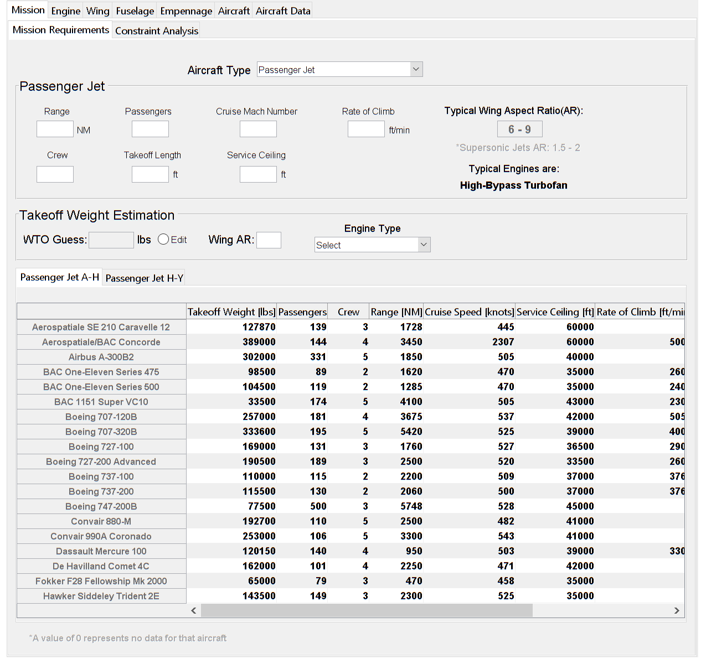

<h3>Concept</h3>

To design an aircraft an initial set of requirements are required. These are usually given in the RFP (Request for Proposal), however they can also be supplied by the aircraft designer to design an aircraft to meet a certain requirement. Therefore, the first step in PAC is inputting a set of requirements to design the aircraft around.

