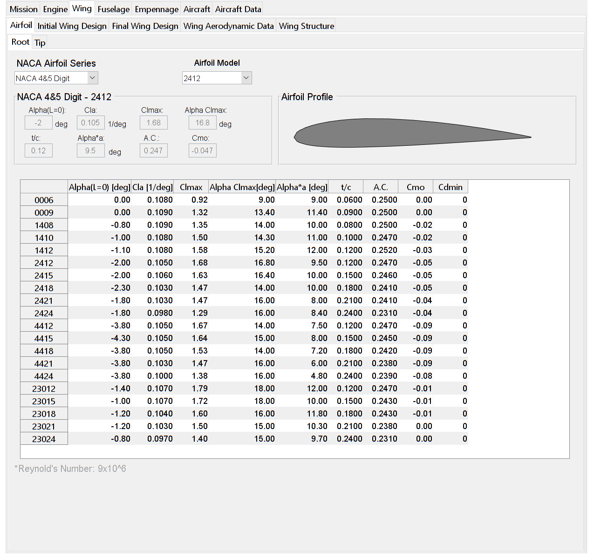
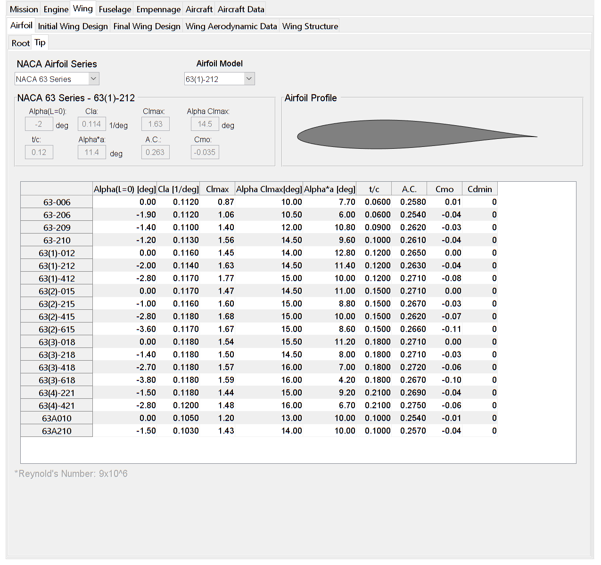
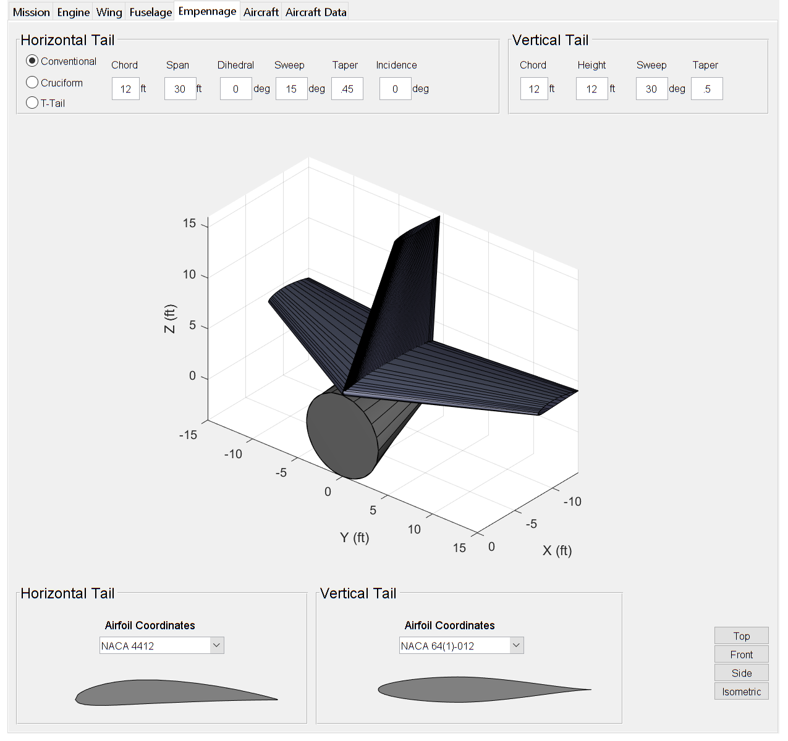

<h3>Concept</h3>

To design an aircraft an initial set of requirements are required. These are usually given in the RFP (Request for Proposal), however they can also be supplied by the aircraft designer to design an aircraft to fulfill a certain role. Therefore, the first step in PAC is inputting a set of requirements to design the aircraft around.

<h5>Mission Parameters</h5>
Under "Mission Parameters", the user has options that are both generic and specific to each aircraft type. Parameters such as <i>range</i>, <i>takeoff length</i>, and <i>service ceiling</i> are the same for each aircraft type. While, parameters such as <i>passengers</i> or <i>maximum mach number</i> are specific to transport and military aircraft respectively.

The takeoff weight estimation is calculated both from the historical data that is tabulated below and specific for each aircraft type, and the inputted aircraft parameters.

Once the estimate for the takeoff weight is determined, the constraint analysis is constructed and is used to determine the wing loading and thrust loading the aircraft is designed around.

<h5>Engine Parameters</h5>
Once an estimate for the thrust loading is determined, the engine that meets the necessary requirements can be selected under the "Engine" tab. Multiple engine manufacturers are listed and for each engine that has enough data to be used in PAC, that engine is tabulated as well.

<h5>Wing Parameters</h5>
Once the wing loading estimate is found, the root and tip airfoils can be selected and the initial wing designed. From the wing loading, an estimate for the required wing area to generate sufficient lift is found. 

Under the "Final Wing Design" tab, the user can modify the planform shape of the wing. This allows the user to design a multi-segment wing relatively easily.

<h5>Fuselage Parameters</h5>
After the wing is designed, the fuselage can be modeled. After specifying the fuselage length, radius, and nosecone length and tailcone length, the completed fuselage is shown. Currently only the "Fuselage Requirements" tab works. Future versions will allow for complex fuselage shapes, similar to the "Final Wing Design" tab.

<h5>Empennage Parameters</h5>
After the fuselage is designed, the empennage can also be designed. Three different options can be selected: <i>Conventional</i>, <i>Cruciform</i>, or <i>T-Tail</i>. The design parameters for the horizontal and vertical tail are the same as the wing, with the vertical tail being half a wing.   

<h5>Aircraft Parameters</h5>
Finally, after designing all the components, the model of the aircraft is shown. Parameters such as wing location and distance from tail can be set. Also the designer can specify the type of engine (turboprop engines are not currently modeled), number of engines, the engine location from the leading edge, location along span and for multiple engines, distance between each engine.
