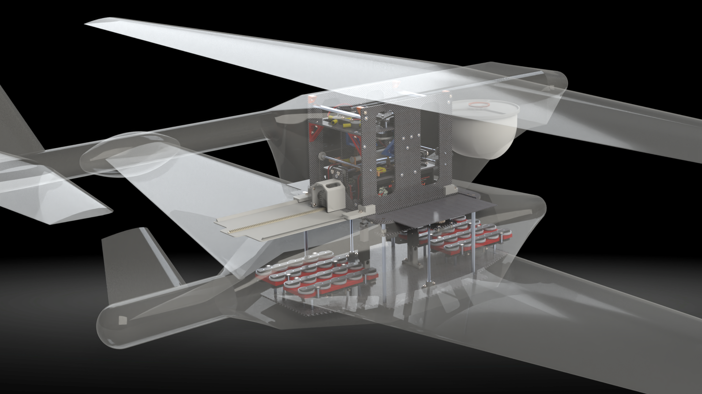

<h3>Project Overview</h3>

<a href="uav_background.html">Background and Motivation</a>

<a href="uav_concepts.html">Concept</a>

<a href="uav_sensor_test.html">Sensor Test</a>

<a href="magnets.html">Attachment Concepts</a>