<h2>Sensor Test</h2>
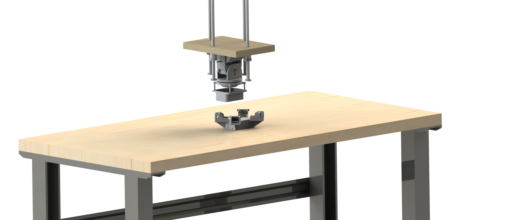

<h3>Goal:</h3>

<i>Develop method of measuring distance between two aircraft with $$\pm$$ 1cm accuracy<i>

To align both aircraft in space autonomously requires a high level of accuracy and reliability. There are 3 main regions if you will, that R-1 will have to navigate in to successfully dock with M-1. The first, long distance, covers the region of 10 miles to 30 feet(26,400ft-30ft). The second, medium distance, covers the region of 30 feet to 1 foot (30ft-1ft). The third, short distance, covers the region of 1 foot to 1 centimeter (1ft-0.033ft). 

The long distance region is measured by <a href="https://holybro.com/collections/dronecan-h-rtk/products/dronecan-h-rtk-f9p-rover?variant=42737172119741">GPS</a>. The medium region is measured by a <a href="https://www.stereolabs.com/zed-x/">3D stereo camera</a> to accurately line both aircraft up. The final region is measured by <a href="https://www.adafruit.com/product/5396">ToF</a> sensors. The reason a ToF sensor was chosen rather than an <a href="https://www.adafruit.com/product/1031">IR sensor</a>, <a href="https://www.adafruit.com/product/1343">ultrasonic rangefinder</a>, or <a href="https://www.adafruit.com/product/4441">LIDAR sensor</a> is due to the high accuracy needed to dock R-1 with M-1. The IR sensor has a range of 20-150cm with $$\pm$$ 10cm accuracy. The ultrasonic rangefinder has a range of 30-500cm with $$\pm$$ 10cm accuracy. The LIDAR sensor has a range of 5-1000cm with $$\pm$$ 1cm accuracy. Finally, the ToF sensor has a range of 0.1-600cm with a $$\pm$$ 1cm accuracy. 

While the LIDAR has the required accuracy, the minimum distance of 5cm is too large to ensure an accurate dock. Also at $60 each, the sensor is at the higher end of the market. The ToF on the other hand has a minimum distance of 0.1cm. Also at $15 each, the cost is much more economical and allows for multiple sensors to be integrated into the system for increased precision.

Of the 3 regions, the short distance is the most important because it is the zone where the final docking is performed. Therefore, a high degree of accuracy and precision is required to ensure a repeatable system. To develop a precise method of control, testing is necessary to determine the optimal placement of sensors and whether the sensors can accurately detect movement.

<h4>Test Concept</h4>
The initial concept consisted with sensors mounted on a pivot on both sides of the M-1 and R-1 models. The idea was that because the resolution of the ToF sensors was only $$\pm$$ 5mm, if two sensors are with a offset between them, a resolution equal to the offset is possible.

<h6>Version 1.0 Sketch</h6>
<div class="text-center p-2">
	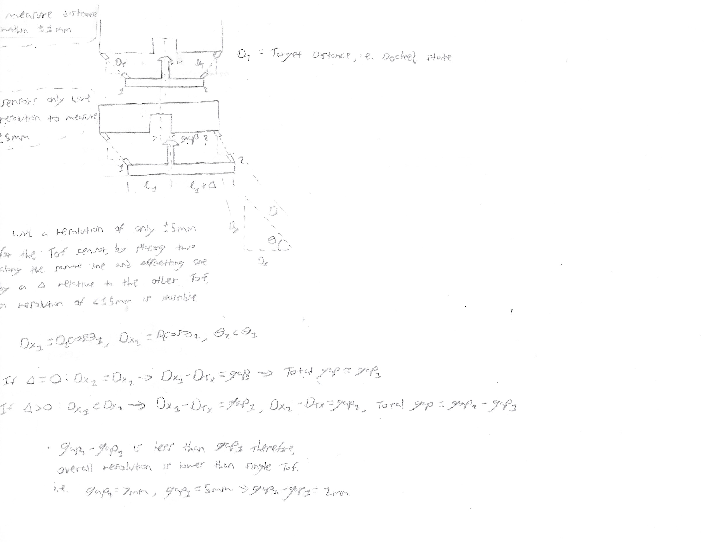
</div>

Unfortunately, this concept only works if the two models are within the same plane so that the distances can be easily measured. The next iteration utilized four sensors mounted in an "X" pattern to account for the models being out of plane. Also for the second iteration, an adjustment of the required resolution was relaxed due to no longer using a mechanical interface for the aircraft docking. 

<h6>Version 2.0 Sketch</h6>
<div class="text-center p-2">
	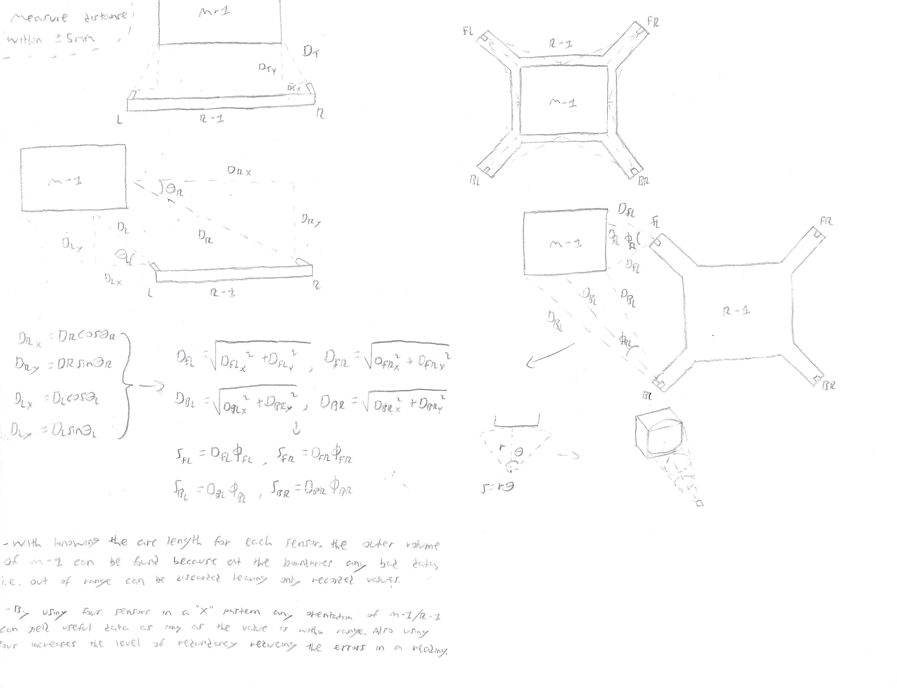
</div>

With four sensors covering each corner of the M-1 aircraft, a higher degree of fidelity is possible then with only one or two sensors. For simplicity of the initial test, the sensors only rotate parallel to the arm. Rotation perpendicular to the arm will be possible with the next test with version 3.0.

<h6>3D Printed Models - Version 1.0 and 2.0</h6>
<div class="text-center p-2">
	
	
</div>

For the initial test, the deviation between the measured distance and the actual distance was determined. A test rig was constructed to hold the M-1 model steady at a fixed height above the R-1 model. The movement of R-1 was limited along the X-Y axis by following increments marked on the grid of a foam board. This allowed the measured ToF distance to be compared with the actual location marked on the board.

<h5>Sketch of Test Rig</h5>
<div class="text-center p-2">
	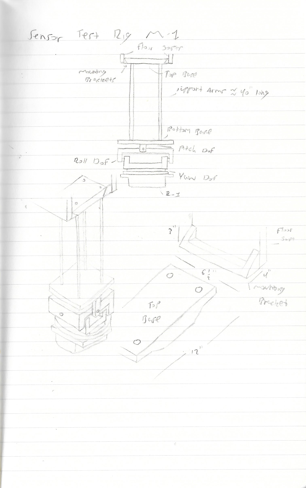
	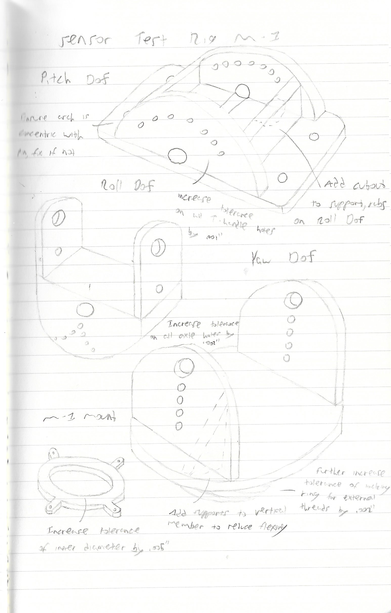
</div>

<br>

<h5>CAD Model of Test Rig</h5>
Solidworks was used to create the models and for rendering of the final assembly. Modeling the workbench was done to ensure the test rig fit within the required dimensions (mounted to the basement ceiling). It also allowed for easy reference of the overall size and scale.
<div class="text-center p-2">
	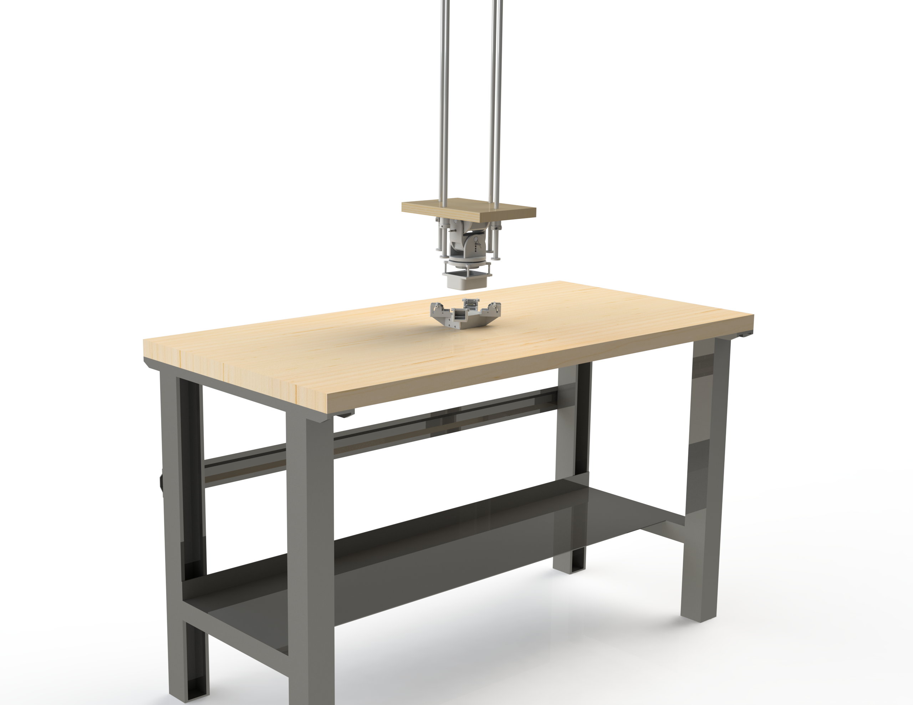
</div>

<br>

<h5>3D Printed Test Rig</h5>
The test rig and models of M-1 and R-1 were 3D printed with a Formlabs Form 3 3D printer. The M-1 and R-1 models were printed with Formlabs Rigid Resin and the test rig components were printed with Formlabs Tough 2000 resin. Also the stoppers at the end of the support shafts were printed with Formlabs Durable resin.
<div class="text-center p-2">
	
</div>

<br>

<h4>Test Setup</h4>
To collect the data, an <a href="https://www.adafruit.com/product/3857">Adafruit Feather M4 Express</a> with a <a href="https://www.adafruit.com/product/2922">Adalogger FeatherWing - RTC + SD Add-on</a> and <a href="https://www.adafruit.com/product/2693">SD Memory Card</a> were used. The Feather M4 ran CircuitPython to initialize the sensors and write the data to the SD card. The Adalogger housed the SD card and real-time clock. The SD card stored the data to be easily transferred to the computer after the test.  

<div class="text-center p-2">
	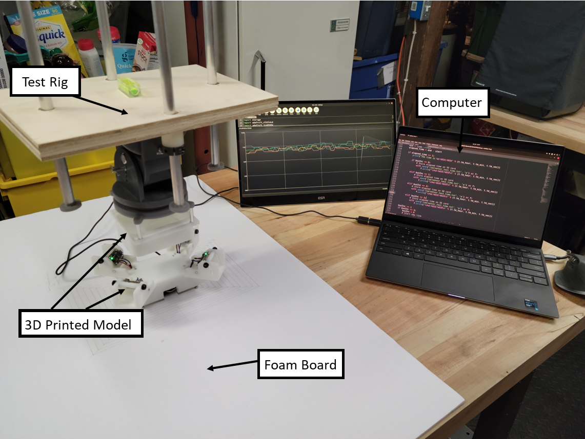
</div>

<div class="text-center p-2">
	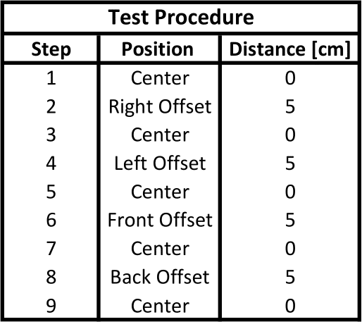
</div>

The Feather M4 can easily receive data through its I2C port, however its only possible to connect a single address at a time to the Feather. To receive data from multiple sensors, a multiplexer is necessary to select the unique addresses for each sensor. The following code block initializes the Front Right(FR) sensor. Sensors, Back Right(BR), Front Left(FL), and Back Left(BL) are initialized in the same way.

```python
	def ToF_Sensor_FR():
		"""Setup Front Right Sensor"""
		i2c = board.I2C()

		# Create the Mux object and set it to the I2C bus
		tca = adafruit_tca9548a.TCA9548A(i2c)

		# Set the ToF sensor to the Mux
		vl53= adafruit_vl53l4cd.VL53L4CD(tca[2])

		vl53.inter_measurement = 0
		vl53.timing_budget = 10

		# Start measuring values
		vl53.start_ranging()

		# Skip over bad data
		while not vl53.data_ready:
			pass

		# Print distance to screen
		vl53.clear_interrupt()
		print("Distance: {} cm".format(vl53.distance))

		# Wait for 1 millisec
		time.sleep(0.001)

		# Return distance value
		return vl53.distance
```
Code block that loops through each sensor. Outputs a plot on the Mu Python editor to see movements of R-1 in near real-time and writes the sensor reading to a text file. Also, it grabs a timestamp of the sensor reading and writes it to a text file as well.

```python
	busInc = 0
	elapsed_time = 0
	while True:
		t = rtc.datetime
		start = time.time()

		# Initialize Sensor
		print("Bus number: ", busInc)
		if busInc == 0:
			BL = ToF_Sensor_BL()

			# Store data on SD card
			with open("/sd/sensor_test_data.txt", "a") as f:
				f.write("%0.1f\t" % BL)

		elif busInc == 1:
			BR = ToF_Sensor_BR()

			# Store data on SD card
			with open("/sd/sensor_test_data.txt", "a") as f:
				f.write("%0.1f\t" % BR)

		elif busInc == 2:
			FR = ToF_Sensor_FR()

			# Store data on SD card
			with open("/sd/sensor_test_data.txt", "a") as f:
				f.write("%0.1f\t" % FR)

		elif busInc == 3:
			FL = ToF_Sensor_FL()

			# Store data on SD card
			with open("/sd/sensor_test_data.txt", "a") as f:
				f.write("%0.1f\t" % FL)

		# Plot on X-Y scale
		print(
			(
				(FR),
				(FL),
				(BR),
				(BL),
			)
		)

		# ToF_Sensor(busInc)
		print("")

		end = time.time()
		elapsed_time = end - start

		if elapsed_time >= 1:
			print("The time is %d:%02d:%02d" % (t.tm_hour, t.tm_min, t.tm_sec))

			if busInc == 0:
				# Store elapsed time on SD card
				with open("/sd/sensor_test_time.txt", "a") as f:
					f.write("\n%d:%02d:%02d\n" % (t.tm_hour, t.tm_min, t.tm_sec))

			elif busInc == 1:
				# Store elapsed time on SD card
				with open("/sd/sensor_test_time.txt", "a") as f:
					f.write("\n%d:%02d:%02d\n" % (t.tm_hour, t.tm_min, t.tm_sec))

			elif busInc == 2:
				# Store elapsed time on SD card
				with open("/sd/sensor_test_time.txt", "a") as f:
					f.write("\n%d:%02d:%02d\n" % (t.tm_hour, t.tm_min, t.tm_sec))	

			elif busInc == 3:
				# Store elapsed time on SD card
				with open("/sd/sensor_test_time.txt", "a") as f:
					f.write("\n%d:%02d:%02d\n" % (t.tm_hour, t.tm_min, t.tm_sec))

	busInc += 1
	if busInc == 4:
		busInc = 0

		# Start new line
		with open("/sd/sensor_test_data.txt", "a") as f:
			f.write("\n")
```

<h4>Test Data</h4>
The data was inputted into Microsoft Excel for analysis. A sample output of the test data is shown below. The multiplexer cycles through the sensors every tenth of a second. Due to the slight lag in running through the FOR loop, the actual number of cycle completed is eight per second. After every loop a timestamp is shown indicating when the data was acquired. 

<div class="text-center p-2">
	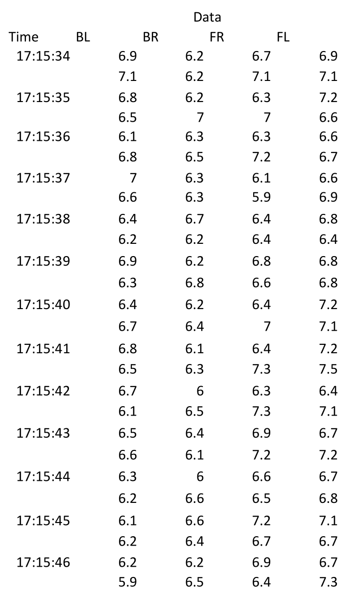
</div>

<h4>Data Analysis</h4>
The results were graphed on a scatterplot and compared to the actual distances moved. The R-1 model was translated through four directions: <i>right</i>, <i>left</i>, <i>front</i>, and <i>back</i>. Each direction of translation is easily indicated as a hump on the graph below. As expected each sensor is grouped in a group of two depending on the offset. Moving from <i>right</i> to <i>left</i> groups sensors: BR/FR and BL/FL together. Moving from <i>front</i> to <i>back</i> groups sensors: FR/FL and BR/BL together.

<div class="text-center p-2">
	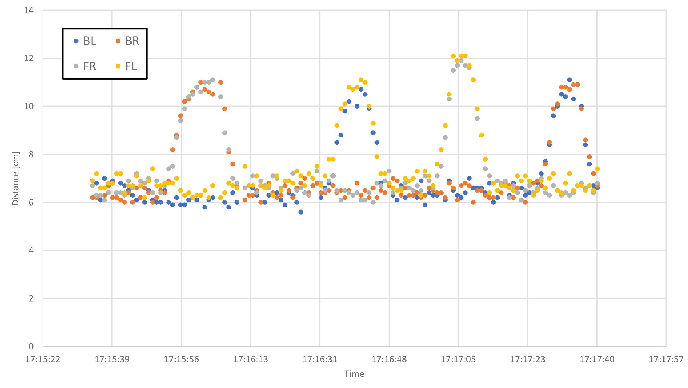
</div>

Due to noise when the sensor is stationary, the measured distance from the target fluctuates about 1 mm around the actual distance. Therefore, in an attempt to isolate the noise, the average distance rather then the maximum or minimum distance is used. Each reading has to be conterted into it's vector components to compare it wiith the actual distance moved. Each sensor is set at 46.7 degrees (the maximum angle based on existing CAD geometry). The X-Axis component <i>X</i> can be found using geometry, where $$\theta_S$$ is the angle of the sensor and <i>D</i> is the measured distance from the sensor. 

$$
X = {D \above{1pt} \cos(\theta_S)}
$$

As shown below, due to the placement of the sensors, the height of the M-1 model, and the angle of the sensors, any translations that don't have the laser touching the side of the M-1 model are not indicated. This causes the measured distance of R-1 to be lower than the actual distance, resulting in a significant percent difference between the measured and actual values.

<div class="text-center p-2">
	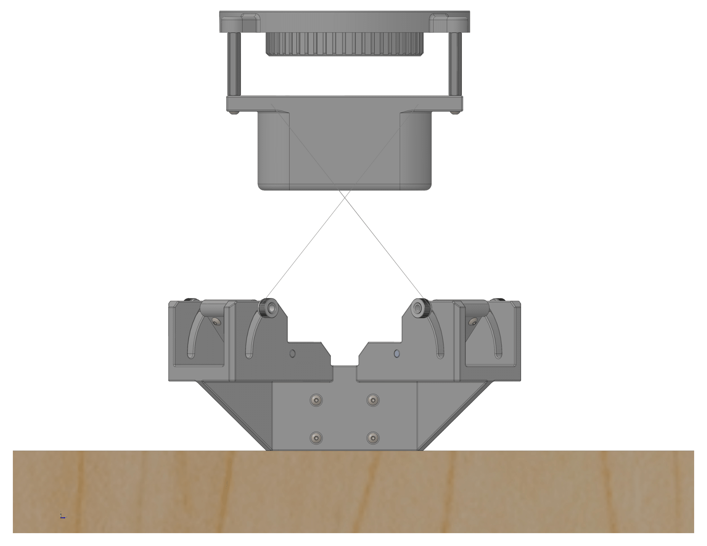
	
</div>

<div class="text-center p-2">
	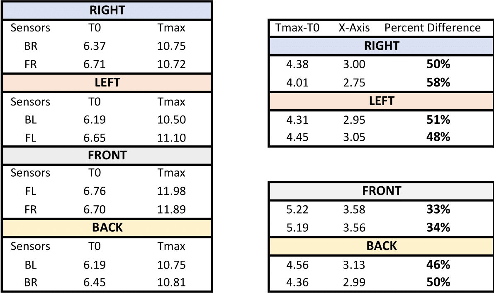
</div>

<h4>Results</h4>
Four ToF sensors were used to measure the position of the R-1 model relative to the M-1 model. The R-1 model was translated 5cm from its starting position of directly beneath M-1. It was moved parallel to the Right side first, moved back to the starting location and then moved along the Left side. After moving back to center, it was moved along the North side, then back to center, and finally along the Back side and then back to center.

Based on the initial test performed, using a ToF sensor for precise positioning of the two aircraft is possible with a few modifications. First more degrees of rotation of the sensors is necessary to ensure the lasers are always on the M-1 model. Second, if the sensor is only facing the underside of M-1, any translations in M-1 or R-1 are not indicated. This is indicated by the large percent difference between the measured and actual values ranging from 33% to 58%. For instance, R-1 was offset 5cm to the right of M-1. However, the BR ToF only indicated 3cm of offset, while the FR ToF indicated 2.75cm of offset. Rapid positioning of the ToF would more accurately indicate any translations by finding the edges of M-1 to determine when M-1 or R-1 move. 

Third, implementing a scanning function to scan the outer surface of M-1 would increase the precision due to having multiple readings per sensor, rather then only two each. In other words, instead of cycling through the sensors every tenth of a second with the sensors only looking at the same point, have the sensors make multiple passes across the entire outer surface. This ensures more precise readings by continually cross-checking each value with a previous value.